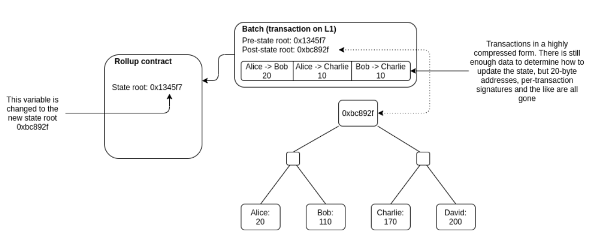

---

layout: single
authors: 
 - name: MadNeutrino
   link: https://www.youtube.com/watch?v=dQw4w9WgXcQ
 - name: Psyf
   link: https://www.youtube.com/watch?v=dQw4w9WgXcQ
tags: Architecture
header: 
    overlay_image: https://images.unsplash.com/photo-1567359781514-3b964e2b04d6?ixlib=rb-1.2.1&ixid=MnwxMjA3fDB8MHxwaG90by1wYWdlfHx8fGVufDB8fHx8&auto=format&fit=crop
    caption: "[**Unsplash**](https://unsplash.com)"
    show_overlay_excerpt: false
---

Blockchains are hitting scaling bottlenecks as more dApps and users onboard. The challenge lies in keeping blockchains decentralized, secure, and energy-efficient as we scale. In this article, we discuss vertical scaling techniques such as block size and block frequency tweaks. We also discuss horizontal scaling techniques such as using multiple chains, Layer 2s, sharding, history expiry, data availability sampling, and proposer-builder separation. 

> ⛔ **Prerequisites:**
> - How blockchains enable trustless, permissionless systems using Proof of Work consensus.[^consensus]
> - How Smart Contracts work and how nodes make Ethereum blocks.[^jordan]
{: .notice--warning}

👉🏽 **How should you use this article?** \
\
We wrote this article to synthesize the knowledge we gathered over the last few weeks and simplify it to a few fundamental concepts. We’ll keep our piece short and focus the discussion on scaling blockchains, with links to in-depth resources. Use this as a map if you’re new to the topic, or as a review after you’ve returned from the rabbit hole. \
\
We intend to keep the sections updated as the field evolves, So check back from time to time (or subscribe!) if you want to keep up with how this space evolves.
{: .notice--info}

## The Basics

ℹ️ Before we dive in let’s take stock of what a blockchain is and why we want them in the first place. As we dig deeper, definitions will start getting confusing and lines will start getting blurry. It is important to agree on a few core principles and the big picture so we don’t get lost in the weeds.
{: .notice--info}

Here is a quick high-level overview of how a Proof of Stake Blockchain works:[^posfocus] 

1. A blockchain is a shared[^shared] database[^database], where no edits are allowed.[^append] You can only add new rows and a set of rows make a block.
2. To add your row to a new block, you send the data (called transaction, or TX) you want to add over a peer-to-peer network. 
    1. An important property of public blockchains is Censorship Resistance. Any anonymous wallet should be able to add any valid transaction to the database without unfair delays. This makes blockchains ***permissionless***.
3. We have multiple computers (called **validators**) to help us add the transactions to the database in a secure way. 
    1. The more validators we have[^diverse] the more ***resilient*** the network is against downtime.[^247] Downtime can happen due to Denial-of-Service attacks by malicious actors, catastrophic natural events, and zero-day vulnerabilities in the blockchain’s client software.
4. In proof of stake, a random validator is picked to:
    1. group one or more transactions together into a block
    2. do any computation required (in the case of smart contracts) and summarize the result.
    3. Propose this bundle to the other validators for inclusion at the head of the chain. 
        1. Each validator checks if the computation is okay, and decides whether to accept the block. If there are multiple valid blocks for this round, they have a rule that they can execute independently to pick one.
        2. Once the block is decided, if anyone broke the rules, they are penalized. This is called “slashing” and is also encoded as a transaction that validators have to vote on. 
5. From 4cii, we see that the “truth” in a blockchain is determined by what most of the validators say is the truth.
    1. So, if most of the validators[^most] cheat the same way, consensus can still be achieved. And the minor who didnt cheat will be “lying” even if they followed the earlier rules. 
    2. To ensure that the validators don’t collude against the interest of the community[^actors] (e.g. via censorship or by rewriting the rows in the database), anyone should be able to verify the state of the blockchains. This is what gives blockchains their ***trustless*** property.
6. To maximize the key properties of resilience, permissionlessness, and trustlessness, public blockchains must be as decentralized as possible. To maximize decentralization, we have to make it easy for people to validate the state of the blockchain themselves. 

> 💡 **Proof of Work is a throttling[^throttling] mechanism**
> Most of this article talks about proof of stake (PoS) blockchains. In PoS chains, the block proposers only have to do the work required to build the block. Most of the scaling strategies are about figuring out how to reduce this work (horizontal) or get the validator to do more of it (vertical). 
> 
> In a Proof of Work (PoW) blockchain, you need to build the block **AND** solve a puzzle, **which is explicitly designed to be random and difficult.** So PoS is inherently a more scalable system than Proof of Work, but it is a much more complex system with more moving parts.
{: .notice--info}

## Why is Scaling in the Spotlight?

What does it mean to scale a blockchain? 
In short, **we want to add as much data as possible every second.**[^TPS]

Over the last few years, we’ve seen more and more use cases being built on top of public blockchains. If we look at the Ethereum network, the number of transactions per day has skyrocketed from ~10k/day in Jan 2016 to ~1M/day in Jun 2022 - a 10x increase.

|  |
|:--:| 
| *source: [etherscan.io](http://etherscan.io/)* |

The number of active wallets per day on Ethereum in June 2022 is about [700k](https://bitinfocharts.com/comparison/ethereum-activeaddresses.html#alltime).[^web3now]

Assuming more and more use cases are built on top of blockchains[^usecases], it is not difficult to imagine a world in the future where activity on blockchains will be on the order of 100x to 1000x what it is today.

However, we see the gas fees in Ethereum already become prohibitively expensive for the average user when there’s a sudden spike in interest in a particular protocol. We’ve seen some low-fee blockchains become clogged or go down when they encounter such spikes too. 

The problem will only get worse as more users and developers onboard the Web3 ecosystem. 

## Scaling Computer Systems

In computer science, there are two main approaches to scaling:

1. **Vertically:** Make nodes[^nodes] more and more powerful. This is what Web1 servers typically looked like since most users would only be consumers of the data. *As traffic increased, you’d upgrade servers’ specifications to keep up.* Beyond a certain point, scaling vertically stops being a cost-effective way.
    1. As you scale blockchains vertically, they become more centralized since the minimum requirements for running a node increase. Thus, we see highly specialized computers dominate the share of validators.[^asics]
2. **Horizontally:** Add more nodes and split the work between them. Web2 systems generally evolved this way to distribute web traffic evenly between their centralized servers and databases. The amount of coordination overhead incurred by the system depends upon the number of nodes[^coordination] and how tightly controlled the environment is.[^control] 
    1. For decentralization in Web3, blockchains need to scale horizontally without making strict assumptions about network topology (e.g. maximum latency) and network participants (e.g. minimum system specifications). Good behavior has to be coordinated in this trustless environment using asymmetric encryption and game theoretic incentive mechanisms[^sticks]

We can start to see a fundamental tension between scaling and decentralization. This tension,  coined as the “[Blockchain Trilemma](https://medium.com/certik/the-blockchain-trilemma-decentralized-scalable-and-secure-e9d8c41a87b3)” by Vitalik Buterin, underlies all conversations around scaling.

There are a few questions to ask while evaluating any blockchain scaling approach:

1. Does this approach make blockchains more or less decentralized?
2. Where are the attack vectors of each approach? How can we mitigate them?
3. How much can we scale current systems with this approach?

With all that context out of the way, let’s try and scale blockchains!

## Vertical Scaling - Bigger Nodes are Fine

💡 Most of the vertical scaling discussion are mainly aimed at PoW chains. 
{: .notice}

Let’s assume we have a chain that produces a block every 10s, and every block can hold a maximum of 100 transactions. 

This maximum limit is called a **maximum block size**. Why do we have such a limit? If everyone who wants to include a transaction in a block gets to include it, it might not be possible to process it in 10 seconds. So we need some kind of limit to ensure whoever is producing a block can actually do it in 10 seconds. The way people include their transaction over others is by getting into an auction for the ***blockspace***, by paying a higher amount for a unit of **gas**.[^gas]

If we increased the maximum blocksize to 200 transactions, more transactions could be included in each block. However, if the block size is too large only those with powerful computers will be able to get the block ready within 10s.[^blocksizewar]

Another way to scale the TPS is to produce a block every 5s instead of every 10s.[^param] This also creates a centralizing force since it requires a highly specialized computer.[^latency][^storage] This prices out the low-tier nodes.[^rpi]

Ultimately, this is a balancing act for protocols. There are a few Alt L1s taking a vertical scaling approach, but Ethereum and Bitcoin are resisting such changes. On the other hand, Binance Smart Chain maintainers don’t care if the requirements are high, so they increase the blocksize as demand increases. Since they use Proof Of Authority,[^permission] they only select validators with powerful setups capable of handling a block every 3 seconds, and the keep increasing the blocksize as the demand increases. Solana does something similar. Anyone can run a validator on Solana, given they can meet the high bar for minimum specifications. Their hypothesis is that computers will get faster with time, so we can afford to have system requirements which are considered heavy today. They also allow have neat tricks like parallel processing of transactions to speed up block computation.

## Horizontal Scaling - Don’t Give Up On Decentralization!

So if we want the everyday person with a relatively modern consumer PC to be a validator, how do you scale? **The core idea is to distribute the work required across many participants such that each participant does less work *while keeping other participants in check*.** 

💡 In 2022, some of these are cutting edge ideas and active areas of research. As such the implementations and search spaces are intertwined - you need the entire picture of scaling to understand how the different levers affect each other’s effectiveness and work together to ensure security and liveness of the network. For example, increasing the storage requirements by making calldata cheaper might hurt decentralization, but that can be counterbalanced by introducing history expiry at the same time.
{: .notice--warning}

### Rise of Layer 2s

A Layer 2 (L2) is a setup where some of the computation is pre-processed by a different set of nodes so the validators on the L1 dont have to, and then post the end result to the L1.[^offchain] This can take various forms depends on what is processed by L2 and what is finally added to the L1.

#### HTLC (Hash Time Locked Contract a.k.a State Channel)

A state channel is simple. Let’s suppose you go to your neighborhood coffee shop every morning and pay in Bitcoin. It’s cool, but cumbersome[^cumbersome] and expensive.[^expensive] What if you could open a “channel” with the coffee shop and sign a message that says you authorize the transfer of 1 BTC to them. But you only give it to them off-chain and don’t broadcast it to the network. The second time you come around, you sign a new message saying you will be transferring 2 BTC to them instead, and so on. At the end of the month, when you owe the shop 30BTC, the shop can send your latest signed message on to the chain and collect their 30 BTC. We’ve now replaced 30 payments over a period of time into 1 settlement TX on-chain.

An example of such an L2 is the [Bitcoin Lightning Network](https://medium.com/geekculture/bitcoins-lightning-network-explained-298c6aafe117).

#### Plasma

Other such Layer 2 solutions include Plasma, where a separate network[^network] can periodically commit the state on L1.

|  |
|:--:| 
| *source: [https://polygon.technology/solutions/polygon-pos/](https://polygon.technology/solutions/polygon-pos/)* |

#### Rollups

Recently, rollups are getting a lot of attention. Rollups are blockchains on top of blockchains. The main difference between a plasma and a rollup is that the entire rollup can be reconstructed from the parent chain. Whereas in Plasma, most of the data is on the Plasma chain. The main chain only serves to keep the Plasma chain accountable. 

In short,

- Rollups provide a Fair Sequencer (currently a centralized server) which orders the TXes
- Users send their TXs to Fair Sequencer,
- Fair Sequencer batches up all the TXes, and changes its own state tree. It also commits the TX batch and new merkle root on an L1 smart contract.
    - This lets anyone recreate the state of the L2 from scratch if they run an L2 full node
- This smart contract then secures the system with proofs.
    - If it’s a Zero-Knowledge Rollup, the Smart Contract verifies the validity of the batch of transactions and correct state transition using some fancy mathemagic.
    - If it’s an optimistic rollup, the smart contract doesn’t do anything immediately. It marks this commitment as “pending” for a few days of challenge period, during which anyone can dispute the commit by submitting a fraud-proof.

|  |
|:--:| 
| *source: [https://vitalik.ca/general/2021/01/05/rollup.html](https://vitalik.ca/general/2021/01/05/rollup.html)* |

Rollups are an active area of research[^zk], but they’ve been seeing [accelerating adoption](https://l2beat.com/) in the ecosystem thanks to their super low gas fees. Rollups networks also have additional vectors of attack such as:

- Most L2 still use a Centralized Sequencer, which could censor some txes, or go down.
    - Usually there is a way for users to bypass the sequencer and force a TX / group of txes via the L1 directly.
- ~~Sequencer being unfair by ordering transactions as they want to extract MEV [Maximal Extractable Value]~~
    - ~~Active area of research; we’ll discuss this later in a section below~~

To facilitate the rise of L2s, L1s like Ethereum are [considering providing special transaction types called “Blobs” that are cheaper than regular transaction types](https://www.eip4844.com/).[^eip4488] They can be cheaper because we know that the blob data doesn’t need to be executed by the L1 (since the L2 executes it). The L1 validators need not process / validate this data in any way. They just include it in the block as is, apply compression techniques, and (potentially) discard the data after a time period, which all translates to less resource demand on the validator.

Sharp readers will be right to point out that this will most likely increase the amount of storage required by validators (since the validators have to store the calldata/blob posted at every blob). An interesting approach to keeping the storage requirements of a blockchain under control is to [delete the history](https://eips.ethereum.org/EIPS/eip-4444). Your bullshit detector should go off here! Wasn’t recreating the current state from genesis a fundamental tenet? History Expiry proponents argue that if you give the network enough time to download all the block data, full nodes should be able to delete older blocks in the interest of efficiency. Actors who need the data, such as indexers and archives, will be able to download whatever they need in the meantime. Note that this means full nodes won’t remember what the blockchain state was at a very old block height. They will still have to know the state tree at the latest block.

If you’re spinning up a new node, you should be able to fast-sync to the latest checkpoint from one of the archival nodes. If the incentive structures for archival and foolproof retrieval can be established, this becomes a low-hanging fruit. This is called “Weak Subjectivity”.[^checkpointing]

### Divide and Conquer - Sharding

The idea in sharding is to split the validators into groups, and have them check only parts of the blockchain. Think of it as moving from a single-core computer to a multi-core computer that can process transactions in parallel.[^shard] But this can get quite hard to coordinate - especially if a transaction includes interactions in multiple shards. Ziliqa, Elrond utilize sharding to scale, but we don’t know enough detail to comment further. 

Execution Sharding was also part of the original Ethereum scaling roadmap.[^eth2] Since then, Ethereum has pivoted to a rollup-centric roadmap. The bet is that Rollups will become the main consumer of blockspace on the L1. We need to be able to let the L2s do that without massive penalties, and increase how much data they can post on the block. So Ethereum is focusing on data sharding to keep the storage and network requirements of validators low so they can each verify only part of the block, and collectively verify the whole block (more on this on the PBS and DAS section).[^shardeddb]

### Make it Cheaper to Check if Something is Wrong

There are 2 ideas in this space to maintain decentralization as we scale:

1. Breaking down the work of the “Chosen Validator”[^chosen] into 2 parts - building and proposing - *so we can decentralize **block** **production** further.* 
2. Reducing the work of Validators[^both] so that light machines can successfully do the job - *so we can decentralize **block** **validation** further.*

#### Proposer-Builder Separation  (PBS)

Here the idea is that we will split the work of the validators into:

1. **Builders:** A smaller set of people with large resources who will do all the computation all the transactions and group them into a block. They have some way to prove that they did the work. These builders can be beefy[^beefy] because we only need 1 honest builder in the network. (**Honest Minority Assumption**) 
2. **Proposer:** A different group then is responsible for checking the proofs **(and the key here is that the checking the proof is much less work than actually doing all the work**). The **proposer verifies a block statelessly**[^stateless]**, which is why they can run on much lighter hardware**.[^light] Put another way, Proposers can check the validity of a block using zero-knowledge proofs - without actually downloading the full contents of the block or reconstructing the state**.  As long as the proposer group is large and decentralized, the system will stay decentralized. (**Honest Majority Assumption**)

This solution also helps in with another centralizing force - [Maximal Extractable Value](https://ethereum.org/en/developers/docs/mev/). MEV is the maximum value that can be extracted from the inclusion, exclusion, and reordering of TXs in a block.[^darkforest]

With a lot of MEV opportunities floating around (e.g. DEX price discrepancies), miners run complex algorithms to search for these opportunities. And the miners who can come up with the best MEV strategies can get better returns over time, than those who cant. This acts as a centralizing force where the smaller miners get out-competed since the large miners are willing to work for lesser block rewards. We might even see validators outsourcing this function to big farms that specialize in extracting MEV.

Protocols have to innovate MEV mitigation mechanisms to push back.[^flashbot] This is especially important for Ethereum, since issuance to validators after the merge will drop. Validators' income sources will revolve around priority fees, incentivizing MEV.

With PBS, the builder isn’t the one proposing the block, so as long there is more than one builder, they would need to bid for the the proposers to choose their block, and hence will share some of their MEV gains with the proposers to make sure they get included. We’ve effectively shared the rewards (Priority fees, MEV etc) and incentivized everyone to cooperate.[^pbsworkflow]

#### Data Availability Sampling (DAS)

PBS concedes the fact that block production will move to centralized entities and codifies defenses against malicious history rewrites and future interference. This is done by ensuring Light Proposers can keep the the Beefy Builders accountable. Recall in “Vertical Scaling” we talked about how increasing blocksize will decrease decentralization. PBS aims to reach the holy grail - but we need DAS to get there.  

Here, we further split the idea of validating a block into 2 parts: 

1. Check the proof for proper state transitions inside the block by the Builder/Producer. 
2. Ensuring the block’s data is available in the network. 

Recall that in PBS, we’ve significantly reduced the computing power required to validate state transitions (#1). However, since the Validators haven’t seen the underlying data, they don’t know if the Block Producer actually shared the data. Without the data available for future reconstruction (e.g. if the Producer goes offline or turns malicious) nobody will know the current state of the blockchain.[^malicious] This is a form of Data Unavailability attack. 

**DAS** is a way to do #2, ie. check if a certain block of data (let’s say 10000 transactions totalling 10MB) was made available by asking for **any random sample of the data** (let’s say only 10KB). So anyone can check data availability without a fast internet, unlimited bandwidth and a huge storage drive[^smartphone]

The basic idea is as follows:

1. After a new block is produced, a validator could **randomly and anonymously** ask for parts of the TX data in the block from the producer.
    1. They should store this part and respond to other participants asking for this part[^expiry]
2. All the validators in the network do the same. 
3. Validators can reconstruct the block (by talking to each other and gathering missing pieces) if need be[^datasharding]

The problem with this naive solution is that a Producer can destroy trust in the entire system if they hide *just* 1 byte of data. To solve that problem, Producer does something called erasure coding before Step 1. Erasure coding is a technique to “stretch” the data with redundancy. As long as **any** 50% of the stretched data is available, 100% of the original data can be reconstructed. To hide even a tiny part of the original dataset, the producer has to hide > 50% of this stretched dataset. Which means that if you ask for 10 random samples from the stretch-set[^datasize], and all 10 were available, you can be 99.9%[^calc] sure that the original dataset is available in full.[^assume][^erasure]

Another nice property we gain from DAS is that the more decentralized the validator network, the bigger the blocksizes can be safely.[^clock] If you want to increase your confidence, just sample more parts! Holy grail!?[^lightnode]

|  |
|:--:| 
| *source: [https://members.delphidigital.io/reports/the-hitchhikers-guide-to-ethereum](https://members.delphidigital.io/reports/the-hitchhikers-guide-to-ethereum)* |

### The Multi-Chain Thesis

Let’s create more blockchains! Each chain has their own set of validators with custom parameters, governance and consensus mechanisms. Each chain can specialize in a particular use case and tune themselves accordingly. For example: GameFi projects can run on cheap and fast chains while DeFi runs on Ethereum for better security guarantees. In fact, we already live in this world since we have lots of “Alt L1s”. 

The problem with this approach is fragmentation of liquidity and loss of composability. Interoperability between different chains is not a solved problem.[^bridges] The Cosmos ecosystem has been working on these cross-chain problems for quite some time. They’ve come up with a generalized messaging protocol called the “Inter Blockchain Communication” (IBC). They want anyone to be able to spin up and customize a chain easily using open source projects like Tendermint Core, CosmosSDK, Ignite CLI. In the Cosmos model, the validator sets are independent and don’t keep a check on the others. Each validator set can be small because the work is now split between the blockchains. 

|  |
|:--:| 
| *source: [mapofzones.com](http://mapofzones.com/)* |

However, bootstrapping the security of a new chain is a difficult problem. Avalanche and Polkadot are trying to find a middle ground, where they have multiple chains which share security. In Avalanche, the sub-chains have the option of using their own validators to secure the subchain. While the subchain validators will also have to validate the main chain, they dont have to validate the other subchains which helps with scaling. Polkadot has a similar system but the parachains are more closely tied to the parent chain.

## Conclusion

You should now have a good understanding of various techniques protocols are using to scale blockchains. 

In the future, we’ll be looking at some concrete examples of L1s trying to scale their ecosystems. This series should include the likes of Ethereum, Cosmos, Celestia, Polkadot, Avalanche, Solana and more. Watch the space!

Follow us on [Twitter](https://twitter.com/jezer0x) for updates. \
Join our [Discord](https://discord.gg/jkBF9mpQ6w) to discuss and learn together. 

[^consensus]: [3blue1brown explainer here](https://www.youtube.com/watch?v=bBC-nXj3Ng4)
[^jordan]: [Jordan’s explainer here](https://www.youtube.com/watch?v=kCswGz9naZg)
[^posfocus]: Though we are going to focus on Proof Of Stake blockchains, most of the discussion will also apply to proof of work chains as well, just that some of the finer details will vary
[^shared]: i.e. distributed
[^database]: i.e. ledger
[^append]: i.e. append-only
[^diverse]: and the more diverse the validator set
[^247]: so that activity on-chain can continue uninterrupted 24/7
[^most]: definition of “most” depends on the blockchain
[^actors]: normal users, honest validators, developers, protocols
[^throttling]: the opposite of scaling
[^TPS]: often referred to as TPS, or Transactions Per Second
[^usecases]: e.g. Decentralized Social Media, more of the Finance industry, Metaverse, and Gaming
[^nodes]: 
    There are fundamentally 4 resources a full node needs:
    - CPU → To manipulate state, run smart contracts and check the validity of transactions, etc.
    - Memory → To cache “active” data so the CPU doesn’t have to wait around for it to load from storage.
    - Storage → To store the snapshot of the blockchain’s world state at each block.
    - Network Connection → To talk to peers in the network and receive broadcasts of new transactions to put in mempool [where TX is kept by nodes until included in a block], queries from light clients, and sync to the tip of the chain.

[^asics]: e.g. expensive GPUs, ASICs, mining farms
[^coordination]: intuitively, faster to coordinate 10 nodes than 1000 nodes
[^control]: more control = more assumptions you can make about the behavior of the system safely
[^sticks]: i.e. sticks and carrots
[^web3now]: Ethereum is mostly DeFi and NFTs at this point, and the data presented above does not take into account all the activity happening on L2s and other L1s
[^gas]: every byte of blockspace costs a certain amount of gas
[^blocksizewar]: In fact, the [“blocksize wars” raged on for years in the Bitcoin ecosystem until SegWit and lightning went live and the small blockers won.](https://www.bitrawr.com/bitcoin-block-size-debate-explained)
[^param]: You could easily tweak the block time by adjusting the difficulty in the PoW algorithm, or changing a config in a PoS network - but you’ll have to balance that between cost to miners, TX fees, and UX for users
[^latency]: 
    On a PoW system, miners are incentivized to work on the longest chain. When a miner successfully mines a block, it broadcasts it to the system and starts work on building on top of it. The way miners know about a new block [so that they can validate it, stop trying to make a block on its parent and instead build on top of it] is by “gossiping” with their peers in the network. Owing to organic network topology and inherent latency, it might take a miner some time to receive the latest block.
    In this “gap” the miner will waste energy. Even if the miner does find a correct solution to the puzzle, the network would have already moved on and will ignore this “orphan” block.
    It is in the interest of the network to give miners enough time between blocks to “sync up” and reduce the proportion of orphan blocks.

[^storage]: Having 2x more data per second would also mean the storage requirements for running a node would grow 2x faster
[^rpi]: such as an old phone or an Rpi you have lying around
[^permission]: which makes it a permissioned blockchain
[^offchain]: also known as moving computation “off-chain”
[^cumbersome]: you need to wait 60 mins at the cafe for 6 block confirmations
[^expensive]: the TX fee is more expensive than your coffee!
[^checkpointing]: Most PoS chains are comfortable with checkpointing. Even Ethereum’s CASPER will codify checkpoints lagging only 2 epochs (~64 blocks).
[^shard]: each shard being 1 processor
[^eth2]: formerly known as Eth2.0
[^shardeddb]: 
    Data sharding is used in the world of centralized databases. In a sharded database with many nodes, the data (and operations over the data) is divided over the nodes. This means that no one node has the entire dataset, but it can be reconstructed by talking to multiple nodes [or having a node coordinate it, which is more common.] if anyone needs it [also for failure recovery, redundancy and some optimizations.] Even though most indie hackers can’t afford a SSD with 10TB of space, they can buy 15 with 1TB each and set up a 10TB capacity database.

[^chosen]: i.e. the validator randomly selected to propose a block in this slot
[^both]: Both the “chosen validator” and “attesting validators”
[^beefy]: Since they have to maintain the upto-date state of the EOAs and contracts, execute every transaction to change the states and search for MEV on top.
[^stateless]: ”Stateless” means that you don’t need to reconstruct the state of the entire Blockchain to verify it
[^light]: e.g. doesn’t need a big, fast NVMe SSD
[^darkforest]: 
    To see MEV in [action](https://www.theancientbabylonians.com/a-primer-to-flashbots-and-mevs-the-dark-forest-of-ethereum/), you can create a smart contract, fund it with ETH and then have a public call that gives you back the ether. ***Someone*** will inject a tx before yours with a higher gas fee so it gets picked ahead of your tx. By the time your tx tries to get the ETH, the contract will already be empty. This ***someone*** can be a miner, in which case, they don’t even need to pay high gas fees. What’s protecting you from being censored is that the miner can’t be certain that they will be the first ones to create a block. But if all the miners can get more money from front-running you, then your tx will be delayed and it becomes a form of soft-censorship.

[^flashbot]: in the meantime, 3rd parties like flashbots are helping to democratize MEV
[^pbsworkflow]: 
    The workflow with PBS may look like as follows: 
    1. Proposers can receive TXs from users, put them in the mempool and give Builders the list of transactions to build blocks out of.
    2. Builders run their own algorithms to extract as much MEV as possible out of this list. They create a block and send it to proposers. 
    3. Builders then compete on fees to woo Proposers. 
    4. Proposers can commit to which bundle they’ll accept and then the Builder. 
    5. Builder can reveal the data in the bundle. This way Proposers can’t “steal” the MEV.
        1. Even if Builder doesn’t reveal, Proposers will get the fee so Builder gets penalized!

[^smartphone]: i.e. you can do it on a smartphone!
[^datasharding]: Note: we’ve achieved data sharding along the way too!
[^expiry]: for a limited amount of time if History Expiry is implemented too
[^datasize]: regardless of the size of the original dataset
[^calc]: 1- 0.5^10
[^erasure]: 
    The actual erasure coding scheme used in practice is a 2D coding with KZG commitments/fraud proofs. This is to ensure the erasure coding was done in a proper way (and not filled with junk by the Producer). This also ensures that the data can be recreated without the need for a super computer. Read this for more info: [https://members.delphidigital.io/reports/the-hitchhikers-guide-to-ethereum](https://members.delphidigital.io/reports/the-hitchhikers-guide-to-ethereum)

[^assume]: assuming other validators are doing so too, and that the Producer doesn’t know who the requests are coming from and hence can’t do selecting revelation
[^clock]: given Builders can keep up with the clock
[^lightnode]: It’ll be interesting to see what happens to light clients as the differences in resource requirements between light clients and validators decrease dramatically (You can still run a validators without staking if you don’t want the rewards)
[^eip4488]: The predecessor to this is [EIP-4488](https://eips.ethereum.org/EIPS/eip-4488), which suggested we reduce calldata gas cost
[^network]: with its own validator set and consensus rules
[^zk]: especially in the realm of generalizable EVM implementations with fast and/or succint ZK proofs
[^malicious]: even though we know the state transitions were done properly by the Producer!
[^bridges]:
    Suppose you want to use your BTC on Ethereum. To do so, you’ll have to “bridge” your BTC over. Most of these bridges today make trust assumptions that make decentralization maximalists queasy. In a nutshell:
     - People send their BTC to an address controlled by Third Party, along with a memo of which Ethereum address should get the BTC.
     - When Third Party’s “node” sees this TX on-chain, it mints a “wrapped” version of BTC on Ethereum.
     - Reverse the process to get your BTC back on Ethereum.

    The Third Party is the single point of failure. We’ve seen quite a few hacks of these kinds of bridges since these become honeypots for attackers. Once the funds are stolen, you can no longer redeem the Wrapped asset 1:1 for the native one.
