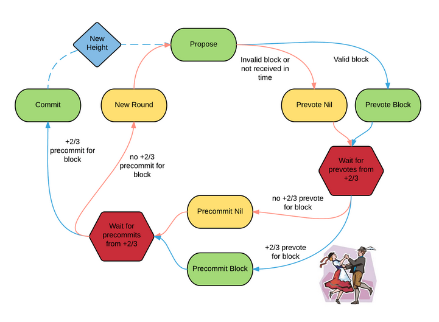

## What is Consensus?

Consensus means a general agreement has been reached between multiple parties. When you and your friends go out for dinner and (finally!) agree on a restaurant to go to, you’ve reached a consensus. The process you used to reach this consensus is called a consensus mechanism (or consensus protocol). For example, for most votes in the group chat, the youngest gets to decide, or use youngest if there is a tie.

{: .align-center}
Me and the boys reaching a consensus on who to mess with next.
{: style="text-align: center;"}

Systems made of multiple nodes (aka distributed systems)[^distributedsystemexample] also need to use consensus mechanisms to maintain a “shared state” (a singular view of the system). In the blockchain context (which can be thought of as a distributed database context), reaching consensus means the network participants have come to a general agreement on the global state of the blockchain at a given moment.

## Consensus in Traditional Distributed Systems

Traditional Web2 giants have had to deal with consensus complexities for a while now.

Traditional Web2 giants have had to deal with consensus complexities for a while now.
To understand why this is such a difficult problem, let’s look at a hypothetical system. Suppose Company A has 10 servers located globally with users worldwide able to interact with each other. Users’ computers interact with the server nearest to them to minimize latency. Assuming the 10 servers have to agree on a shared truth, we immediately run into problems. If many people are commenting on a viral post via Server 1 and others are commenting on the post via Server 2 at the same time **(concurrency),** the servers need to exchange messages **(asynchronous process)** to figure out the ordering of the interactions (**clock-drift** makes getting a global clock complicated). This coordination also has to happen between all 10 servers in parallel. The process is complicated further because any of the nodes may crash at any time (**fault tolerance**) or the network may drop/delay packets (**unbounded latency**).

To tackle all these problems, the servers have to run an identical consensus protocol such that the ordering of events and resolution of conflicts can be done, usually by relaxing some of the constraints mentioned above.[^traditionalconsensus][^relax]

{: .align-center}

Decades of distributed systems research have produced breakthroughs and successful implementations (e.g. Paxos and Raft), enabling huge-scale companies like Facebook and Google.

## What do Blockchain Validators Need to Agree on?

Since consensus mechanisms are complicated processes, you want to minimize the amount of data you need to reach a consensus on to provide useful service. All the other states in the system can either be derived from this set or, should not need consensus for proper functioning.

For example: if users are “reacting” to a post, the servers don’t have to maintain a strict ordering of reaction timestamps, so they can simplify the consensus mechanism there to building a complete set of (reactions, reactor) or (#reactions).

Similarly different blockchains (and their layers) define what consensus means in different ways.

- Most blockchains today reach a consensus on the strict ordering and validity of transactions[^validity] (e.g. Ethereum and Bitcoin).
- Some blockchains relax the constraints by only requiring that validators converge on a partial ordering in the form of a Directed Acyclic Graph (e.g. Avalanche).
- Some blockchains leave the validity and interpretation of transactions up to the layers built on top (i.e. rollups) and provide consensus on the integrity [^integrity] and availability [^da] of data in the system (e.g. Celestia, post-Dank-Sharding Ethereum).

## So What’s Different in Blockchains’ Consensus?

The one saving grace is that Company A owns and controls all the servers, so the consensus protocol running on one server can assume that all the other servers are playing by the rules (i.e. are good actors). Here, Company A is the ultimate authority as they can change the protocol and underlying data however and whenever they want.

**This ultimate authority is what we’re trying to get rid of in public blockchains.** Since there is no ultimate authority that owns all the nodes, we cannot assume all the nodes in the network (often run by anonymous actors) are honest. We have to deal with this additional failure mode - where malicious nodes may withhold information, lie and even coordinate for their own benefit. This is a “Byzantine” environment, and the name originates from a paper called [“The Byzantine General’s Problem”](https://en.wikipedia.org/wiki/Byzantine_fault).

{: .align-center}
More complicated models divide the actors into 3 buckets - “always malicious”, “always honest” and “rational”. The rational node may be malicious or honest depending on the self-benefit analysis.
{: style="text-align: center;"}

To ensure coordination in such a hostile environment, blockchains use rewards to incentivize proper behavior and punishments to discourage malice. They also have to fine-tune the incentive and reward mechanisms such that honest mistakes are not harshly punished and incentives don’t tend towards centralization [^centralization]. **Economic incentives are a form of social consensus mechanism.**

## Byzantine Consensus Trade-Offs

Over time, researchers have separated the concerns in a Byzantine environment into 2 categories.

1. **Safety (aka Agreement):** All non-faulty nodes will decide on the same state. This guarantees that the system (given enough "honest" nodes) can stay in sync at time t+1 since they agree on a single valid global state at time t. For blockchains, safety violations will occur if there are 2 different valid chains.

   {: .align-center}
   Safety getting violated
   {: style="text-align: center;"}

2. **Liveness (aka Termination):** All non-faulty nodes will _eventually decide_ on the same output. For blockchain, liveness violation means the system has come to a halt and no more blocks are being produced.

   {: .align-center}

**In the case of blockchains, having a live service that can’t agree on what the “truth” is as good as having no service at all. But having a system that is taken down by malicious actors is not useful either.**

According to [FLP](https://en.wikipedia.org/wiki/Consensus_%28computer_science%29#Solvability_results_for_some_agreement_problems), both safety and liveness cannot be achieved in the case of **_asynchronous_, _deterministic_** processes. There are 2 ways forward - relax one of the 2 assumptions:

1. **Introduce non-determinism.** For example, we can use random factors in the consensus mechanism.
2. **Assume network communication is synchronous.** For example, we could put an upper bound to latency by using a timeout mechanism.

**The war of blockchain consensus mechanisms is taking variations on these paths to ensure Byzantine-Fault Tolerance (i.e. system is both live and safe). Some systems also make _temporary_ compromises on liveness and safety.**

## Questions to Ask When Analyzing Blockchain Consensus Mechanisms

1. Who can join the network to become a validator?
   1. What resources do they need to join the network and maintain its share of power over the network?
   2. What are the incentives against misuse of this responsibility and power?
2. What are the steps to go from a user signing a transaction to the transaction being included in the blockchain with high probability that it will not be rolled back?
   1. How can a malicious actor (or set of malicious actors coordinating against honest actors) disrupt each step of the protocol?
      1. Can the protocol detect and punish malicious actors at each step?
      2. Can the users detect and punish malicious actors using the “social consensus layer”?
   2. What assumptions are being made at each step of the protocol?
      1. How can this assumption be broken?
      2. What happens if the assumption is broken

## Introduce Non-Determinism

Consensus mechanisms that rely on random factors are simple to design and understand because they sidestep all the complicated problems that come with the different forms of synchrony assumptions.

💡 We won’t be discussing the application-specific optimizations made in the implementations of these algorithms. While clever, they might distract from the main principles.
{: .notice--info}

### Nakamoto Consensus (Bitcoin)

Here’s how this Proof-of-Work mechanism works [^3b1b] [^whitepaper]:

1. Gather and propagate (using a peer-to-peer “gossip protocol”) valid, pending transactions.
2. Bundle a subset of transactions into a block.
3. **_Try random numbers_** (aka mining) that make the hash of the block match certain pre-defined properties. [^zeros]
4. If you find a valid nonce first, broadcast it to the network and collect your **reward (economic incentive)**
5. If someone else finds a valid nonce first (you must verify this), abandon the block you were trying and repeat from step 1.

Note that there may be a **temporary lapse in safety** if 2 nodes find differing valid blocks at the same time. The network splits (fork) and everyone chooses which one they want to support and tries to build on top of it. Since it is a random process, eventually one branch gets ahead and the network abandons the other. Supporters of the abandoned branch wasted energy **(economic punishment).** This is **probabilistic safety.**

Anyone can join (or leave) the network at will with minimal overhead to the network as a whole [^antisybil]. Whoever joins the network can validate every block since genesis **(objectivity).**

This mechanism **optimizes for liveness** since “halting” is not an option unless every node shuts down (i.e. as long as one miner is online, the network can keep making blocks). The algorithm adjusts the difficulty of finding a valid hash such that the frequency of blocks can remain roughly constant regardless of total hash-power.

The way to attack the safety of this network is by doing a “51% attack”, where a malicious actor has a majority of the hash-power in the network:

- can dictate which transactions censor/prioritize because their chain will be the longest.
- cannot change history that’s too far back, because finding a valid block is energy and resource intensive (random process) [^pos]

  {: .align-center}
  Real-life footage of mining
  {: style="text-align: center;"}

## Assume Synchrony in Various Forms

### Tendermint Consensus - Splitting the Synchrony Assumption (Cosmos)

If we make a synchrony assumption to ensure liveness, and the assumption fails, the blockchain stops producing blocks. If we make a synchrony assumption to ensure safety, and the assumption fails, the blockchain will have 2 valid states and split into 2. **One could argue that even though we need both safety and liveness, safety is more important. In other words, we can make some assumptions to ensure liveness but we must use weaker/fewer assumptions to ensure safety.**

This is where [DLS](https://groups.csail.mit.edu/tds/papers/Lynch/jacm88.pdf) comes into play. It showed that we can solve the FLP impossibility by assuming **partial synchrony.**[^flp] DLS argues that **a partial synchrony assumption can be made to achieve liveness**, and **no synchrony assumption is needed to ensure safety.** The next iteration of the DLS idea was the [“Practical Byzantine Fault Tolerant”](http://pmg.csail.mit.edu/papers/osdi99.pdf) (PBFT) algorithm.[^dls] Cosmos’ Tendermint builds on top of these.[^pbft] [Here’s how it works](https://docs.tendermint.com/v0.34/introduction/what-is-tendermint.html#consensus-overview):

{: .align-center}

1. Every round, there’s a new “proposer” in the network. The other nodes are considered “validators”. The probability of being chosen proposer is proportional to the amount staked relative to the other validators. [^sybil]
2. New transactions are broadcast to the proposer.
3. The proposer packages the transactions into a block and broadcasts it to all the validators.
4. The validators vote for the block (given it is valid) in 2 steps - a pre-vote and a pre-commit.
   1. Each node pre-votes for a block (where pre-vote means “I’ve received a block”) and listens on the network for others’ votes. Once 2/3rd is reached we move on to the pre-commit step.
   2. Each node pre-commits to the block (where pre-commit means “I agree with this block”) and listens on the network for others’ votes. Once more than 2/3rd of the network pre-commits, the block is committed (i.e. confirmed). The proposer gets a reward for a successful block.
5. Repeat.

For step 3, if the proposer fails to create a block (may be offline, or unreachable due to network conditions) within a specific timeout **(synchrony assumption)**, this round will have an empty block **(liveness sacrificed).** There are no forks **(safety is not compromised since it does not make synchrony assumptions).** A similar synchrony assumption is put in for the voting steps as well.[^votes]

This means that the network can be kept **“halted” in perpetuity if 1/3rd of the nodes are malicious** and silent. To make the network **“unsafe”, malicious actors need more than 2/3rd of the validators.**

To encourage on-time behaviour, cosmos chains usually punish nodes for being offline (by slashing their stake). Every node that votes for an invalid block gets slashed. Double voting gets slashed as well, as does proposing 2 different blocks (aka equivocation).[^dpos] [^minority] Failure mode for Tendermint is discussed in-depth [here](https://docs.tendermint.com/master/spec/light-client/accountability/).

{: .align-center}
Tendermint Validator trying not to get slashed for being slow
{: style="text-align: center;"}

To join the network you need to put in a security deposit (i.e. stake) and become one of the top ~100 stakers and then wait for the next “churn” (when nodes are kicked and others added). To leave the network you have to wait for a churn as well (else, you get slashed for every round you remain offline). If Tendermint wants to have higher number of validators, they will have to give up on the tight timeouts and make the network slower - the communication overhead increases rapidly. To get around the problem, Tendermint-based networks rely on social consensus and economic incentive mechanisms of staking delegation.

The Nodes that join the network rely on the other nodes in the network to get the ground truth **(aka subjectivity, which is inherent to PoS)**

### Gasper - Finding a Compromise (PoS Ethereum)

There were a few problems that made the Ethereum Research community improve on Tendermint’s design. Key among those is “[Cartel Analysis](https://medium.com/@Vlad_Zamfir/the-history-of-casper-chapter-4-3855638b5f0e)”: it’s economically beneficial for 67% of validators in Tendermint to form a cartel (concentration of power) and to shun the 33% non-cartel nodes to increase their own revenue [^cartel] [^rebuttal] [^posdebate]. This complicated the security model further from the bribing-adversary model (single actor game theory) to oligopolistic analysis (social/cooperative game theory). This led to the realization that detecting censorship by the cartel (and punishing such censorship) would be key. This led to the realization that detecting censorship by the cartel (and punishing such censorship) would be key.

After years of research, Proof-of-Stake Ethereum came up with “Gasper”, a combination of 2 different mechanisms. Here’s how the entire system works: [^ethdevresources]

1. There is **1 slot every 12 seconds**, where a slot can have 1 block. **32 slots make up an epoch**.

   {: .align-center}

2. In every slot, a validator is randomly selected to become the **block proposer**. A separate subset of validators is randomly selected to vote on the proposal **(committee)**.

   {: .align-center}

   1. **Within an epoch runs LMD-GHOST. “**It stands for "latest message-driven greedy heaviest observed sub-tree". Translating it to English, it means:
      1. Regardless of how many messages someone sends, take only the latest one.
      2. Follow the fork with the most attestations (note that there’s no 2/3rds rule as in Tendermint).
   2. Under normal network conditions, the proposer proposes a valid block, and the committee of validators properly attests to it.
   3. If the block proposer is offline (crashed / network fault), they do not get slashed. Their “punishment” is losing out on the potential rewards. This is also the case for the attestors. [^nottender] Slashing should only happen for dishonesty/malice, as far as possible, and there are some kinds of actions that are near impossible to take unless you’re malicious (e,g, double proposing, double voting), in which case you’re progressively slashed until your entire stake is gone and you’re booted from participation in Gasper.
   4. If there’s large network asynchronicity or when a dishonest block proposer has equivocated (i.e. proposed 2 different blocks to different parts of the validator committee) that a fork choice algorithm is required. LMD-GHOST is used to secure the correct chain in these cases.
      1. Note that this fork choice rule means _if_ the network forks under adversarial conditions **(safety not guaranteed)**, the validators have a way to keep making blocks and eventually come to the proper conclusion **(liveness is prioritized).**

3. **Between epochs runs Casper Friendly Finality Gadget.** Within the next epoch boundary (i.e. slot 1 of the epoch E+1), every validator in the network should vote on the validity of the block at slot 1 of the current epoch (i.e. slot 1 of epoch E). This means every node in the network gets 384 seconds to vote. If this slot gets more than 2/3rd of votes, it is considered a “justified" checkpoint, and slot 1 of epoch E-1 is considered a “finalized” checkpoint.

   1. **This ensures “Accountable Safety”**. To create an alternate finalized chain, an attacker would need to either:
      1. own 2/3rd of the total stake, or
      2. destroy 1/3rd of the total staked ether. If 2/3rd of the network voted for 2 forks, it means 1/3rd voted for both (which is a slashable offense), and thus 1/3rd of the ETH will get slashed (a very expensive attack). [^correlation]
   2. **Casper also ensures “Plausible Liveness”**, which says that as long as 2/3rd of the staked ether is honest the network can keep finalizing. However, if 1/3rd of the ether is compromised, the network may fail to finalize. To protect against this, if there have been no finalized checkpoints for 4 epochs, Casper will start slashing validators that have not voted with the majority. This “inactivity leak” will bleed this minority’s stake until the network reaches finality again **(liveness fault is temporary).**

      {: .align-center}

The coordination between nodes is done by the Beacon Chain - joining, staking, withdrawing stakes, and attestation are all happening on the Beacon Chain [^aggregation]. When a new node joins the network, they need to rely on the rest of the network to get the “truth” of the chain (hello again, **subjectivity).** There are 2 other attack vectors that this opens up, and are solved by “Weak Subjectivity”: [^weaksub]

1.  There may be a “long-range attack”, where nodes that were very early in the network release a conflicting fork after a long time. New nodes may use this as the universal truth. To solve this, Ethereum uses the finalized checkpoint as the “universal truth”. New validators will need to independently validate from this point onwards. This limits the range of the attacks by restricting how long forks can be.
2.  If 33% of the validators withdraw their stake and still attest and produce blocks, new nodes might be misled to follow the wrong fork for a few slots. To solve this, the withdrawal period for staked ETH is longer than the time between weak subjectivity checkpoints. If malicious validators try to trick new entrants during this time, their stake will be slashed before a withdrawal is completed.

    {: .align-center}

We haven’t done (or found) a proper “Cartel Analysis” for Ethereum’s Gasper as suggested by Vlad Zamfir, but a few answers from the PoS FAQ at Vitalik’s blog give you the intuitive understanding - see them [here](https://vitalik.ca/general/2017/12/31/pos_faq.html#can-one-economically-penalize-censorship-in-proof-of-stake), [here](https://vitalik.ca/general/2017/12/31/pos_faq.html#will-exchanges-in-proof-of-stake-pose-a-similar-centralization-risk-to-pools-in-proof-of-work), and [here](https://vitalik.ca/general/2017/12/31/pos_faq.html#are-there-economic-ways-to-discourage-centralization).

{: .align-center}

## Miscellaneous

Let’s take a quick look at other consensus mechanisms that don’t fall into the buckets above, but may warrant an honorable mention.

We haven’t dug into these mechanisms, so please take our word with a grain of salt.
{: .notice--warning}

### [Snow](https://docs.avax.network/overview/getting-started/avalanche-consensus) - Leaderless PoS (Avalanche)

The team behind Snow contends that the removal of the quadratic network overhead and the need for a leader in consensus are properties we can do away with and still have a safe and live network. Here’s how it works in Avalanche, where each node follows the same process:

1. **Randomly samples _k_ peers** (sample size) and asks them **“Given this is the latest block I have, give me the next block.”**
2. If more than **_a_** (quorum size) \*\*has given the same response, count it as 1 success for the block.
3. Repeat until some block has **_b_** (decision threshold) votes.

Note that:

- there’s no proposer. Everyone “proposes” blocks in step 1’s response, given they have staked in the network.
- the communication overhead does not increase with the number of nodes in the network, since **_k_** is fixed.
- The liveness and safety of this algorithm are configurable. For example, if a network wants more safety, they have to increase the quorum size - but liveness will be decreased.[^avax]

💡 Avalanche also uses a DAG instead of a linear chain (this is not a property of the Snow Algorithm). This means each slot can have multiple blocks given they don’t contain conflicting transactions, increasing throughput! [^conflux]
{: .notice--info}

### [Algorand](https://developer.algorand.org/docs/get-details/algorand_consensus/)

A Byzantine Agreement Proof-of-Stake protocol that optimizes for speed. For the random selections, **Verifiable Random Functions are used and the selection is secret** (happens without user communication, and only the selected knows they were selected until they send messages). **The VRF and votes are weighted according to the stakes** the account has. Here’s how it works:

1. **Block Proposal:** Randomly selected Accounts propose new blocks to the network. They propagate the block they built, along with proof that they were indeed selected in the secret VRF round.
2. **Soft Vote:** Randomly selected Committee votes on proposals and filters down to one. Committee accounts vote for the block with the lowest VRF hash (which is random too) at timeout. The probability of a fork is extremely low since the probability that 2 valid proposed blocks will have the same VRF hash is negligible.
3. **Certify Vote:** Separate randomly selected committee votes to certify the block after checking for problems such as conflicting transactions.
4. Each node receives a certificate for the block and writes it to the ledger
5. Repeat.

### [HotStuff](https://arxiv.org/abs/1803.05069)

A Leader-Based BFT protocol makes partial synchrony assumption. It simplifies the mechanism by using a linear communication footprint in each round. This allows it to be more “responsive” than Tendermint and Casper.

### [HoneyBadger](https://eprint.iacr.org/2016/199)

Argues that partial synchrony assumptions are not suitable for critical applications like blockchains, since the parameters are tough to tune and transient network conditions may break the assumptions or cripple throughput.

### Using [Proof of History](https://docs.solana.com/cluster/synchronization) to simplify PoS (Solana)

Argues that most consensus mechanisms are slow because of synchronization issues. So they try and tackle that head-on - which also allows them to confirm individual transactions instead of waiting to create a block. Here’s how it works:

1. **Selection**: A _single_ Leader is selected in a **_deterministic_** way beforehand (i.e. is not random)
2. **Proposal with Proof of History for Synchronization (to agree on the ordering of TXes)** - “Leader nodes ‘timestamp’ blocks with cryptographic proofs that some duration of time has passed since the last proof. All data hashed into the proof must have occurred before the proof generation. The node then shares the new block with validator nodes, which are able to verify those proofs. The blocks can arrive at validators in any order.” [^mev]
3. **Vote:** Every 800ms, validators vote on the set of transactions to achieve consensus - “What's happening under the hood is that entries are streamed to validators as quickly as a leader node can batch a set of valid transactions into an entry. Validators process those entries long before it is time to vote on their validity. By processing the transactions optimistically, there is effectively no delay between the time the last entry is received and the time when the node can vote. In the event consensus is not achieved, a node simply rolls back its state.”
4. **Repeat.**

### [Narwhal and Tusk](https://docs.sui.io/learn/architecture/consensus) (Sui)

A new approach where 2 separate protocols run in the same network for different tasks.

- Narwhal ensures “the availability of data submitted to consensus”. This is a fancy way to say the mempools of the stakers reliably get the data necessary to run the consensus stage, even under adverse network conditions.
- Tusk’s simplified job (not replaced by Bullshark) is to agree on a specific ordering of this data made available.

## Conclusion

{: .align-center}
When you _think_ you finally get it
{: style="text-align: center;"}

[^distributedsystemexample]: for example, big databases, application servers, and computer infrastructure running on dozens to thousands of computers
[^traditionalconsensus]: We will not go in depth about consensus mechanisms in traditional crash-tolerant only systems. This is a wonderful article that expands on these: https://www.preethikasireddy.com/post/lets-take-a-crack-at-understanding-distributed-consensus
[^relax]: For example, the unbounded latency problem can be relaxed by using timeouts. The coordination problem can be simplified by partitioning the nodes into different roles (a leader who arbiters, proposers that submit data and passive acceptors). The fault tolerance (mainly crash-faults) are tackled by rotating leaders when the current one fails.
[^validity]:
    Validity is easily established using some basic rules of the blockchain. For eg.

    1. No-one can spend more than they have.
    2. The person who spends their coin, needs to sign it.
    3. If there are smart contracts, Input + Prev. State = New state as per the rules of the VM.
       These can be validated as long as the rules of the blockchain are clearly specified and are made public.

[^integrity]: there is a single agreed ordering of transactions, and they have valid signatures.
[^da]: at some point in time, the data was made widely available
[^centralization]: ie. that only well funded validators can meet the requirements of the system
[^3b1b]: Awesome animated video that takes you through nakamoto consensus in an ELI5 way: https://www.youtube.com/watch?v=bBC-nXj3Ng4
[^whitepaper]: The original whitepaper that started all this is also quite readable and short. Find it here: https://bitcoinwhitepaper.co/
[^zeros]: For example, in Bitcoin it’s the number of 0s at the start of the hash
[^antisybil]: This is Sybil resistance without PKI, where the anti-sybil asset is the mining rig.
[^pos]: Note that this is not the case in Proof of Stake. Creating a block takes way less energy. This and other subtle byzantine failure modes, is why PoS is usually much more complicated than PoW.
[^flp]: Which can mean either of the following 2 scenarios:

    1. Fixed bounds exist, but they are not known upfront.
    2. Fixed bounds exist and are known, but the guarantee starts at some unknown time in the future.

[^dls]: Sadly, DLS was not widely adopted in the real world because it relied on a synchronous processor clock which does not fare well in a Byzantine environment.
[^pbft]: Even PBFT wasn’t practical, simple and scalable enough for blockchain systems. Here’s an article comparing the 2: https://jimyang.medium.com/tendermint-vs-pbft-159b467a9e84
[^sybil]: the anti-sybil mechanism
[^votes]: The fact that every node has to know every other nodes’ 2 step votes (or lack thereof) every round is why Tendermint chains have a small number of nodes. If the number of nodes is increased, each round will take more time and we’ll get slower blocks.
[^dpos]: This is why you see the proliferation of Delegated PoS in Cosmos - users delegate their coins to parties that compete on running the best operations so they gain credibility and are able to stay in the top ~100 nodes with maximum staked.
[^minority]: where invalid here is defined as “not the same as the majority vote”
[^cartel]: "“Tendermint is two dudes!” Matthew Wampler-Doty excitedly told me, one evening. He explained that a cartel of Tendermint validators with more than 2/3 of the security deposits would form, because it does not require participation from the remaining validators to create finalized blocks (these “non-cartel validators” have less than 1/3 of security deposits). These less than 1/3 of nodes would be censored and eventually removed from the validator set. A new cartel with more than 2/3 of the (now smaller) set of security deposits would then form, and this process would continue until only [at most] 2 validators remain.”
[^rebuttal]:
    The Tendermint team disagrees with this viewpoint by invoking the Social Layer as a defense:
    ”Jae also argued that censorship would not be a problem because it would be noticed by the community, who would promptly rebel against the cartel and stop using the blockchain.”

[^posdebate]: Bitcoin is also vulnerable to this, with a lower threshold of 51%. On that note, we didn’t focus on PoS vs PoW in this article because that is well discussed. You can find a good debate [here](https://shows.banklesshq.com/p/the-pow-vs-pos-debate-lyn-alden-and?triedSigningIn=true) with good writeups [here](https://www.lynalden.com/proof-of-stake/), [here](https://medium.com/@VitalikButerin/a-proof-of-stake-design-philosophy-506585978d51) and [here](https://vitalik.ca/general/2017/12/31/pos_faq.html).
[^ethdevresources]: more resources about the merge found at https://ethereum.org/en/developers/docs/consensus-mechanisms/pos/ and https://ethos.dev/beacon-chain/
[^nottender]: This is different from Tendermint, so you don’t need a team of specialists to keep the node healthy with 100% uptime. This is much more “normie-friendly”, increasing the decentralization of the network since everyone is incentivized to run a validator node.
[^correlation]:
    It’s worth noting that the amount slashed is variable on both time and correlation.
    ”… it can be minor (~1% stake for a single validator slashed on their own) or can result in 100% of the validator's stake getting destroyed (mass slashing event). It is imposed halfway through a forced exit
    period that begins with an immediate penalty (up to 0.5 ETH) on Day 1, the correlation penalty on Day 18, and finally, ejection from the network on Day 36.”

[^aggregation]: To remove the quadratic overhead of sending everyone’s attestations to everyone else, ethereum uses [Aggregated Attestations on the Beacon Chain](https://ethereum.org/en/developers/docs/consensus-mechanisms/pos/attestations#aggregated-attestation).
[^weaksub]: Some arguments about why weak subjectivity is fine: https://ethereum.org/en/developers/docs/consensus-mechanisms/pos/weak-subjectivity/#how-weak-is-weak
[^avax]: k = 20, a = 14 and b = 20 in Avalanche.
[^conflux]: DAGs are not limited to Proof of Stake. A project called "Conflux" tried to put DAG on top of Nakamoto consensus.
[^mev]: Note that this can be gamed. "That data is a double-edged sword. On one side, the data "proves history" - that the data most certainly existed before hashes after it. On the other side, it means the application can manipulate the hash chain by changing when the data is hashed.”
