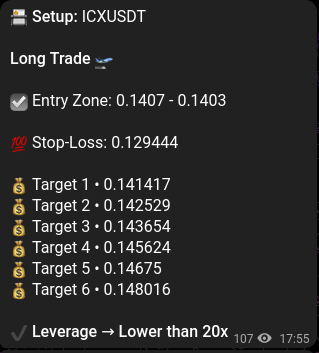
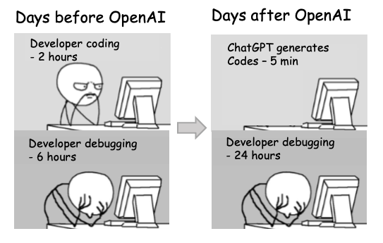

## The Task

I was feeling pretty down after we had to close down a project we had been working on for months and wanted to take a small break from smart contracts to collect my thoughts about what we did wrong. Around the same time, I was digging around Github Copilot and OpenAI's GPT3. They released ChatGPT right around then, and - like most people - I was blown away by its abilities. The new Large Language Model was inpiring me to build something fun and useful to test its limits. But what?

Krenzx was following some Telegram groups that made trading calls in crypto markets and boasted about their success. Maybe we could make a bot that would execute those calls automatically and make some money?

{: .align-center}

As someone who had never traded before[^seriously], I saw this as the perfect opportunity.

## The Test

There were 2 metrics to test the LLMs against:

1. How much Google/StackOverflow do I need?
2. How fast can I iterate on the product?

> "Hey, could you write me a **Python** script that takes in **trading calls** from a **Telegram group** and executes them on **Binance**?"

## The Good

- **Assumptions:** It made a few reasonable assumptions about (1) the contents of the trading call, (2) using a Telegram Bot and (3) using Spot on Binance.
- **Fast Iteration:** It churned out some mostly-usable lines of code that encompassed the entire workflow.
- **Learning:** It would also explain what it was doing. So even though I didn't know anything about the Telegram or Binance APIs, I picked it up faster than I would otherwise[^otherwise].

## The Bad

- **Bugs:** The draft code had some bugs and I couldn't run it directly. I had to ask ChatGPT to tweak some lines and tell it what errors the repl was throwing in order to fix them.
- **Tweaking:** I also gave it examples of chat messages the group sent and had it tweak the parser. The regex it wrote wasn't perfect, but perhaps giving it more examples would have helped it write more generalizable code instead of overfitting to an example.
- **Domain Knowledge:** While ChatGPT greatly reduced my workload, I still had to be careful to ensure the code was bug-free and actually understand what I was doing. As a result, I ended up asking Krenzx and Madneutrino a lot about the futures concepts in order to understand the API, as I couldn't fully trust the language model.[^itried]
- **Infinite Loop:** There were also times when ChatGPT got caught up in loops or made incorrect assumptions about the APIs, requiring me to read the documentation and understand the nuances myself. For example, the Telegram API had multiple ways of doing things and the Binance API was total crap[^tbf]. It also could not deal with multiple versions of SqlAlchemy, and could not code to SQLite spec.
  
  {: .align-center}

## Development and Deployment

- Coded and ran on ReplIt[^whynot]. It was awesome and has come a _long_ way since I last used it in 2018.
- But soon moved it to a DigitalOcean Droplet[^config] because I'd have to learn and make some ReplIt specific changes that I did not want to. Plus if I was ever moving this intro production, pretty sure I'd self host.
- Synced the calls from the Telegram channel to a local SQLite DB and stored logs for what the bot was doing on flat files (to debug - and there was a lot of debugging).
- Started off on the spot testnet but hit annoying limits. So we just YOLO-ed 1K of ACTUAL USDT. To our surprise, we did not lose money. Time spent so far was about a couple days of work, and I think we went at least 2x fast. **As the code gets more complex returns you get from using LLM drops off.**

## Ape In

Encouraged by this initial success, we decided to try futures. This is when it all went downhill[^sweet]. Both Copilot and ChatGPT were kind of useless and I ended up throwing away a lot of the Spot code, rewriting for the futures API and refactoring for maintainability[^maintain]. To be fair, Copilot did act sometimes as a delightful auto-complete. This part of the project took 4-5 days of work, and mostly unaided by LLMs. Here's a prime example of what the current version of ChatGPT/Codex would never be able to figure out: https://dev.binance.vision/t/how-to-implement-otoco-tp-sl-orders-using-api/1622/18

## Future of the Project

Looking to the future, there were 2 potential directions for this side project:

1. Build a BotAsAService. Anyone who wanted to copy trade a telegram channel could give it to us and we'd run it for them for a flat daily fee. One interesting twist on this would be to integrate the LLM into the onboarding flow so it could talk to the user, write a parser, do some testing and deploy it to production all by itself (think @levelsIO style business for software consultancy, but where the typical onboarding personnel/tier3Dev would be replaced by an AI).
2. Ramp up the risk and leverage by sending in a larger amount of money (say 10k USDT), and see where it takes us with a 10x leverage, take profits and stoplosses. While I was tempted, we ultimately didn't have the motivation to risk such a large amount of money without proper backtesting (and I was too lazy to backtest properly). Similarly, we didn't have the motivation to develop our own trading algorithm, as it felt like a PvP game that wasn't adding much value to the world _(spoiler alert: that's the followup post!)_

The money in either the directions did not motivate us, and we found alternative BotsAsAService solutions that seemed to have a reasonable UX. Just make sure you're not using 3commas :clown_face:

But if you're interested in tinkering with the bot yourself, or going ape shit with leverage, you can find the source code [here](https://github.com/madneutrino/trading-bot/tree/main).

Just be careful and don't use more money than you're willing to lose! :monkey:

## Future of Development

Looking back at the metrics we set earlier, we can safely say that LLMs reduced the amount of Googling/StackOverflow I needed by a dramatic amount at the start of the project. It also got me up and running fast with v1, but further iterations were much slower owing to (1) bugs and (2) its inability to access to internet.

Here's someone on twitter saying the same thing, but on a thread:



Both of those problems should be solvable by:

- Scaling up the AI so it can store more context about the entire codebase and relevant libraries. Copilot's underlying model is small in comparison to chatGPT's, but it's difficult to send the entire codebase to chatGPT to get better results.
- Hooking the AI up to pieces of infra it can use to simulate its own answer, test it, and fix bugs. This is what's known as an "Agentic AI" and is a very active area of research. You can see a mind-blowing demo here: https://youtu.be/_3MBQm7GFIM?t=265
- Allowing the AI to search on the internet. This would have solved the versioning problems we saw with Binance, Telegram and SQLAlchemy. Lots of companies are trying to "take on Google" like this. You can check some of them out at You.com, PerplexityAI, Metaphor Systems.

It's pretty clear it's going to change the nature of the job of a software engineer **in a good way**. Gone are the days of "googling stuff is 90%" of my day, and "I will grind Leetcode until I pass interviews". Everyone's productivity will 10x, when going from idea to execution. So what will matter is coming up with ideas, directing the AI superpower properly (almost like a smart, super-fast intern who doesn't know what to do), and iterating on the end result till you are satisfied with your creation.

I'm SO excited to see how this plays out.

[^seriously]: seriously, I'll struggle to explain the difference between margin and futures
[^otherwise]: i.e. by reading docs, seeing and trying to replicate easy examples
[^itried]: Yes, I tried asking chatGPT about the finance concepts but it wouldn't go back and forth with examples, analogies, and step through specific scenarios like my friends would.
[^tbf]: To be fair, even though ChatGPT made incorrect assumptions about the parameters and responses, I'd made the same assumptions before reading the docs. Or maybe it was a versioning problem yet again?
[^whynot]: Because why not explore a shit tonne of things at the same time and whine when it doesn't all work butter smooth - it's 2022 people! I'm an entitled af Dev
[^maintain]: e.g. onitoring, debugging, making future changes, db schema etc. ChatGPT also structures python projects in a very throwaway-script manner which is no bueno for production
[^sweet]: apart from the fact that the futures testnet is SWEET in comparison to the rest of the clusterfuck Binance has
[^config]: Where I had to configure a minimal Ubuntu droplet with poetry+pyenv - BY HAND
