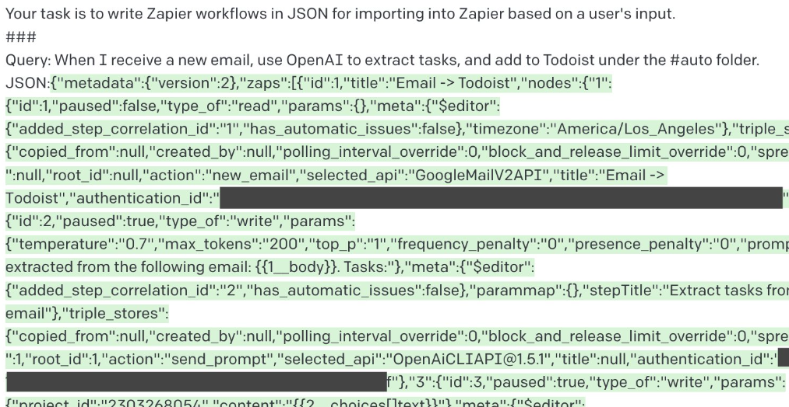
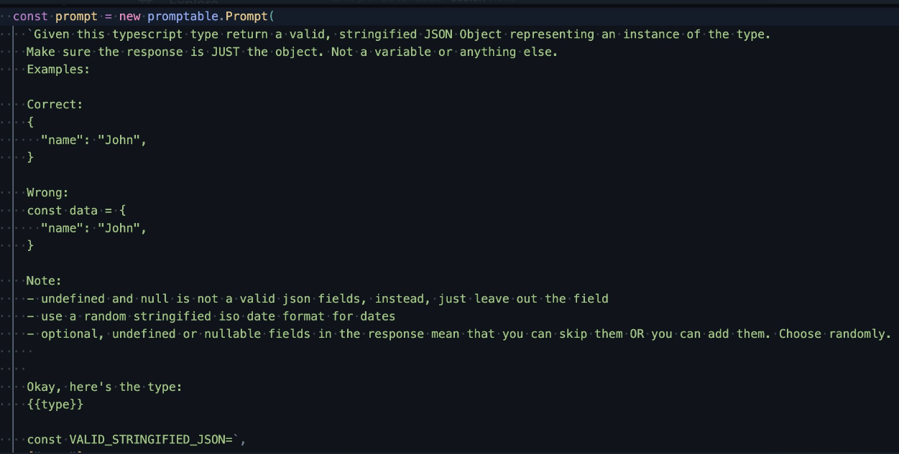

# Prompting GPT to write code

ChatGPT’s ability to write code (in addition to an uncanny ability to “understand” what we are saying) has fascinated all of us the last couple months. In this post, i want to compile some attempts to nudge GPT to write runnable code [as opposed to just guiding us with principles and snippets]. Can we prime GPT in a such a way as to remove the developer from the loop?

## CoPilot

Before we get into directly working with GPT, we must talk about CoPilot. It has been around for a while and saved many hours of developer time. I have been very impressed by its abilities to generate boilerplate / repetitive code based on what I have already written. It is also good at writing out functions based on comments that document the function.

CoPilot is based on Codex, which is currently based on GPT3. ChatGPT is based on a newer 3.5 version (which I think is currently cut ahead of copilot). CoPilot is specifically structured to complete code that you start writing.

Here is a good analysis of what CoPilot is actually doing under the hood: [https://thakkarparth007.github.io/copilot-explorer/posts/copilot-internals](https://thakkarparth007.github.io/copilot-explorer/posts/copilot-internals)

It sends the code from the file you are currently in + other files in your project using the same programming language and asks GPT to generate a completion for the code you are currently writing. Then it does a bunch of cleanup and presents you the autocompletion.

This interface is restrictive when you want to write code from scratch.

[Sidenote: For example, look at [UPG](https://github.com/gptlabs/tools/tree/canary/packages). They have an interface where GPT codes entire programs with you, works with you to make changes, writes it to a file and then executes it for you. But the prompt is hidden behind an API so we dont know what prompt they use. However, it does give us a sense of what could be possible with GPT. ]

In this article, we will explore some attempts to directly interface with GPT to generate code, the prompts being used to do the same, and how we could go about replicating something like UPG.

## Simple Website

Let’s start with an example of someone using ChatGPT to create the html, js and css files of a website.

[https://www.youtube.com/watch?v=ng438SIXyW4](https://www.youtube.com/watch?v=ng438SIXyW4)

Compared to CoPilot, this is better interface for writing code from scratch. You dont have to write any code to prime the model. The prompts are quite straightforward and specify what is needed in English. The dev mentions specific technologies to use, asks for specific code snippets and ChatGPT gets it in the right ballpark.

A job board is a common website pattern and ChatGPT ought to have a lot of examples to generate from. One might have to offer it a lot more guidance if you are building something new.

## Custom **JSON**

Can we ask GPT to generate JSON based on templates or examples?

1. [This example](https://twitter.com/yoheinakajima/status/1617954171780747265?ref_src=twsrc^tfw|twcamp^tweetembed|twterm^1617954171780747265|twgr^|twcon^s1_&ref_url=notion%3A%2F%2Fwww.notion.so%2FCan-we-write-full-software-using-GPT-d7c64816b0d34554a8916ddd3777a1f1) uses a very simple prompt and a couple of example JSON to generate Zapier tasks (the examples arent shown but the prompt is). The generated JSON seems to have been imported fine into Zapier.

   

2. [Here a different approach](https://twitter.com/colinfortuner/status/1619558128772874245?s=46&t=SGTwwmdLIR_cbQuYZSSsrg) is taken to send GPT a json **type**, and ask it to generate Fake JSON for testing. You can see the instructions show examples only of the _format_ of the correct answer, as well as an example of a wrong answer _format_ with some guidance on JSON structure expected. I expect these fine tunings were in response to issues found while testing. Examples generally seem to help a lot!

   

3. We can go one step further, and [ask it to be the entire API](https://github.com/TheAppleTucker/backend-GPT/blob/main/backend/server.py). The dev has simply described Database State in JSON, api call, an app description, and given instructions to GPT to respond with JSON, and show the new state. The starting state seeds GPT with example data, and even though it isn’t specifically labeled as an example. GPT seems to know enough to return the right JSON when you query something. If you look at the code, even the parsing is done using GPT by replaying its own response and asking to return either the state or the. response.
   This works surprisingly well! It even filters correctly if you do `GET /todolist/?completed=false`.

```jsx
This is a todo list app.

API Call (indexes are zero-indexed):
/todolist/1
Database State:
{
            "todos": [
                {
                    "title": "Learn react",
                    "completed": true
                },
                {
                    "title": "Buy Milk",
                    "completed": true
                },
                {
                    "title": "Do laundry",
                    "completed": false
                },
                {
                    "title": "Clean room",
                    "completed": true
                }
            ]
        }
Output the API response prefixed with 'API response:'. Then output the new database state as json, prefixed with 'New Database State:'. If the API call is only requesting data, then don't change the database state, but base your 'API Response' off what's in the database.
```

TodoList is very common application, but it is still amazing how much implicit knowledge GPT knew without us being explicit about it.

## **Browser manipulation**

Here are 2 examples which define a subset of commands, a detailed description and prime GPT to convert english text into set of browser actions.

### [ActGPT](https://yihui.dev/actgpt)

This uses selenium and here you give very specific instructions to GPT (go to wikipedia, find a text box that is visible, enter gpt into the textbox etc.)

Here is the preparatory prompt

````jsx
You have an instance `env` with the following methods:
- `env.driver.find_elements(by='id', value=None)` which finds and returns list of WebElement. The arguement `by` is a string that specifies the locator strategy. The arguement `value` is a string that specifies the locator value. `by` is usually `xpath` and `value` is the xpath of the element.
- `env.find_nearest(e, xpath)` can only be used to locate an element that matches the xpath near element e.
- `env.send_keys(text)` is only used to type in string `text`. string ENTER is Keys.ENTER
- `env.get(url)` goes to url.
- `env.get_openai_response(text)` that ask AI about a string `text`.
- `env.click(element)` clicks the element.

WebElement has functions:
1. `element.text` returns the text of the element
2. `element.get_attribute(attr)` returns the value of the attribute of the element. If the attribute does not exist, it returns ''.
3. `element.find_elements(by='id', value=None)` it's the same as `env.driver.find_elements()` except that it only searches the children of the element.
4.  `element.is_displayed()` returns if the element is visible

The xpath of a textbox is usually "//div[@role = 'textarea']|//div[@role = 'textbox']|//input".
The xpath of text is usually "//*[string-length(text()) > 0]".
The xpath for a button is usually "//div[@role = 'button']|//button".
The xpath for an element whose text is "text" is "//*[text() = 'text']".
The xpath for the tweet is "//span[contains(text(), '')]".
The xpath for the like button is "//div[@role != '' and @data-testid='like']|//button".
The xpath for the unlike button is "//div[@role != '' and @data-testid='unlike']|//button".

Your code must obey the following constraints:
1. respect the lowercase and uppercase letters in the instruction.
2. Does not call any functions besides those given above and those defined by the base language spec.
3. has correct indentation.
4. only write code
5. only do what I instructed you to do.

write code:
1. go to www.wikipedia.org
2. find all textboxes. find one from them that is visible
... and you can give it more instructions ...
20. click on the nearest like button

```python
````

A thin wrapper around selenium API is explained to GPT and it writes code to perform the actions specified using the selenium api. It is then directly passed into exec.

Some useful pointers that were mentioned and used in the above project.

- End the prompt with backquote ```python, so GPT understands it's writing code.
- When the prompt becomes longer and longer, sometimes GPT gets confused. It’s better to dynamically load relevant rules or use chain of thoughts - **the prompt provides the api to be used instead of the full selenium api.**
- Set constraints helps reducing hallucinations such as “Does not call any functions besides those given above and those defined by the base language spec.” - **this also stops it from writing random python code with imaginary apis.**

### [Natbot](https://github.com/nat/natbot/blob/main/natbot.py)

The natbot is more useful IMO than ActGPT as it lets you specify broad objectives and let GPT figure out what to do. It’s simpler version of adept.ai.

This defines a set of instructions (SCROLL UP, SCROLL DOWN, CLICK X, TYPE X “TEXT” etc.) that represent the next action to be performed on the browser at each step. This is then parsed using custom code and sent to Playwright (a headless browser tool like selenium).

The prompt explains the DSL, gives a few examples and sends the following with an generic objective (eg. “Find a 2 bedroom house for sale in Anchorage AK for under $750k”)

```
CURRENT BROWSER CONTENT:
------------------
$browser_content
------------------

OBJECTIVE: $objective
CURRENT URL: $url
PREVIOUS COMMAND: $previous_command
YOUR COMMAND:
```

The browser generates the instruction (eg. TYPESUBMIT X "anchorage redfin”) to perform the next action at each step.

The prompt is similar to ActGPT, but asks GPT to take the decision on what action to perform based on the HTML and an objective. It would be interesting to see if we can remove the custom instructions and ask GPT to generate the playwright code directly.

## What did we learn?

- Give 2-3 examples (referred to as few-shot-learning in many LLM (GPT is an LLM, a Large Language Model) libraries) after your description on the type of answer you need.
- Limit the scope of what the LLM operates on so it doesnt hallucinate too much.
- It also helps to specify what you dont want, along with what you want.

In my next post, I will try using some of these learnings to actually get GPT to write an end-to-end program.
