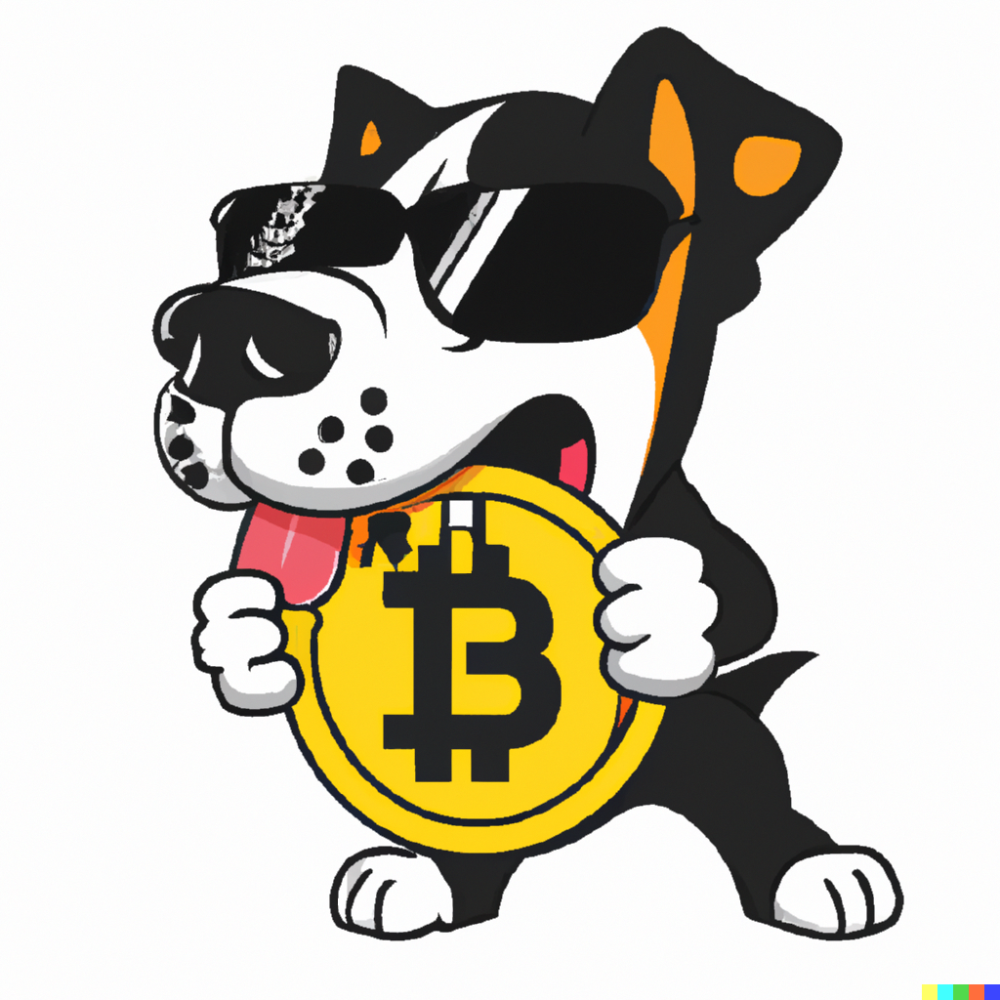

Barren Wuffet was created with the aim of assisting individuals to navigate the DeFi ecosystem and crypto trading while adhering to the web3 philosophy and building with the help of the community. The collapse of 3AC, Voyager, and Celsius led us to develop an on-chain, self-custodial fund management platform, allowing traders to manage funds without having direct access to them. By logging traders' actions on-chain, their historical performance and trading strategies could be verified by anyone at any time.

However, the venture came to an early end due to flawed assumptions regarding the business concept, divergent objectives, and a lack of understanding regarding stakeholder needs. Despite our experience in lean customer development as seasoned entrepreneurs, it is still possible to fall victim to suboptimal business-building practices. In this article, we will examine our errors and the reasons behind them.

{: .notice--info}
If you want to see where we got to technically, you can check out the docs at [https://barren-wuffet.gitbook.io/barren-wuffet/](https://barren-wuffet.gitbook.io/barren-wuffet/)

## Fails

### Understand your customers

The most critical aspect of product development is securing early customers who are willing to pay for the product before it is built, either through advance payments or by providing feedback during the development process. Unfortunately, we failed to attract a sufficient number of customers who were genuinely interested in our product. Rather than seeking out potential customers, we relied on reverse reasoning to validate the existence of a market for our product. This approach hindered our ability to create demand for the product. As a domain expert, I provided justifications that customers couldn't envision the product because it was a novel concept. I also convinced my team that I could represent the customer and knew precisely what was necessary to build. Looking back, these were merely standard excuses to avoid rejection associated with customer development.

{: .align-center}

### Sloppy landscape analysis

My team members were also seeking validation in their own ways. The brain has a way of alleviating fears of being wrong. We took comfort in the fact that there were similar solutions like [STFX.io](http://stfx.io/), a developer working on a copy trade platform for GMX, traders who ran paid signal groups, and trading bot marketplaces. We believed this confirmed the existence of a market. However, many traders we reached out to were not interested, and while we did not receive a clear reason, analyzing how our competition structured their product led us to believe that tax and regulatory implications in their respective markets may have played a role. We justified the existence of Warrent Buffet by pointing out flaws in our competitors' models, but we did not stop to ask ourselves why they avoided the obvious route of allowing a trader to manage a self-custodial portfolio through copy trading.

{: .align-center}

### Regulation

From the outset, our goal was to create a community-led product that would come into being once it attained a certain level of maturity and acceptance. As developers, we believed that we were not subject to any regulations since we were not offering financial advice or managing funds, and since our platform was self-custodial, even traders didn't have access to the funds. However, this belief was misguided and resulted in significant delays and complications.

Although cryptocurrency regulations were not present in the past, governments and regulatory bodies worldwide have recently published draft financial regulations that could have far-reaching consequences for new entrants in the industry. We wanted to ensure that we were in compliance with the laws and that our platform users were not in breach of them either. While these laws are not currently in effect, the prospect of having to navigate bureaucratic obstacles in the future was unappealing to us.

{: .align-center}

### Conflicting interests

We spent the first six months of 2022 familiarizing ourselves with the technical aspects of the web3 ecosystem. We wanted to work on a meaningful project that wasn't too complex for our current technical capabilities, and that we could scale to a reasonable size without external funding. Our idea was that if we built something that solved a problem, we would have a product that could act as a cash cow to fund our future experiments. We didn't want to launch a token, as we felt this went against our ethos. Instead, we wanted to build a product that could potentially share revenue with the community in the future via contributions based on NFTs. However, we soon realized that the community needed an incentive to contribute, and tokens had become the preferred currency to seed initial interest and onboard influencers. We also realized that navigating the regulatory challenges would require us to have the assistance of people who have experience with this and funds, which meant potentially raising money and launching a token in the future. This went against our ethos of putting the community first and having a project that was a cash cow.

{: .align-center}

## Wins

### Lean Development

Despite the challenges, we were able to maintain a lean approach and keep our burn rate low while staying accountable. We focused on defining the minimum viable product, honing in on the core function that would demonstrate its value. To keep costs down, we outsourced non-essential components such as front-end and design to freelancers we found through networking and Upwork. We used DALL-E to generate our logo and memes, and gave advisory equity to friends in the legal industry to help us navigate the legal challenges we faced.

### Tripwires

One of the most critical tools we used to stay on track were tripwires, a combination of deadlines and key success metrics. If we didn't meet a metric by the deadline, we would review the entire plan, including whether we were fooling ourselves with any of our hypotheses. We had monthly tripwires, and when we repeatedly fell short on revenue and assets deposited, we faced the reality that it was time to shut down the project in December.

{: .align-center}

## Conclusion

Our experience with Barren Wuffet reinforced the importance of customer development, and we're now refocusing on this crucial step. We've learned that the cost of wasting time acquiring customers through subsidizing their adoption cost with VC money is much higher than the time spent validating a pain point by speaking with potential customers. Most of our problems above would have been address if we had started with interviewing potential traders.

{: .align-center}
