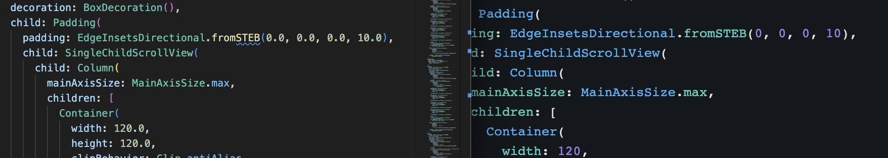

To prototype our [new app](www.sang.bio), we decided to use [FlutterFlow](www.flutterflow.io) (FF). Here I share my experience and some recommendations on how to use FF for rapid prototyping.

## My background

- I have extensive experience with React, front end development and the full web stack in general.
- It's been a few years since I did any mobile development, but I do have experience building moderately complex iOS and android apps.
- I have used firebase for a small project before, but I am not an expert. I do have a lot of experience with both SQL and NoSQL DBs (CouchDB in specific).
- I have tried using code generators before, usually with frameworks I understand and the code produced has been abysmal. Last time I had to rewrite all of it.

## Why Flutter Flow?

- I needed to get a mobile app up and running quickly, and I was told FF could do that.
- I wanted to know what all the fuss around [Dart](https://dart.dev/) and [Flutter](https://flutter.dev) was.
- It didn't seem wise to start prototyping using a language and framework I didn't understand, so I hedged my bets by prototyping using a language and framework I didnt understand, AND a tool that I hadn't used before. (Hey, I think it turned out OK. Check out our [app](www.sang.bio)!)
- Since CoPilot, I have become VERY LAZY about writing code. Especially UI code.

> ⚠ **Caveat**
> Soon after we started, we realized that we could get away with a web app initially and speed up iteration. No problem, flutter has a browser target now. It works.. but I don't think it is a good idea to use Flutter for webapps. That's not what it was built for, and it manifests in subtle ways (For example, you cant create a simple hyperlink using Flutter).

## Did it save time?

Yes! I am a happy paying customer for now.

- I was able to get a mock UI with the core workflow (signup, import reports, manage profile, dashboard) in 2 days. A minimally working product plugged into Firebase was done in a week. It served as a great starting point for us to iterate on, and we had a working demo we could demo to people using the "Preview" feature on FF.
- FF is particularly good at building mockups that "work". You can use firebase collections, data types and app state to structure your data and maintain state offering higher fidelity than a Figma mockup. And it is fast enough that it was viable to skip the figma mockup process and ideate directly using FF.
- 1 month later, I still pay for, and use FF to build out draft UI components, copy them into my code base and then customize them. That said, I hope to ditch FF in another month, because merging code is becoming increasingly annoying.

## What frustrated me?

### Can I just write the code please?

Features that you know can be done quickly in code, but require you to fiddle around the UI for half an hour to find out if there is a way can get frustrating. And once you give up and fix that part in code, you cant import your code back so this component has to be written by hand henceforth [^gitdiff]. After the first week I found it easier to setup a CI and starting using my own codebase as the source of truth. [Flutter has great docs](https://docs.flutter.dev/get-started/install) and it took < 1 day to setup my dev env + CI.

FF does offer some ability to write _custom code_ as functions, but the editor is quite annoying. Copy pasting is janky, error checking is janky, you can't import packages into the function [^noimports], plus no CoPilot (_Tab_ _tab_ why doesnt it read my mind?! ARGH).

{: .align-center}

Some examples of when you'd just want to switch to VS Code:

- The flutter flow list views are setup to query firebase using a **single** query, doing a set of map or filter operations on that query and displaying it.

  - If you have group-by like queries, you need to write a custom function to serve as the data source.
  - If you want to merge multiple lists to display something, you need to create a container per query which results in a lot of boilerplate code.

{: .align-left}
{: .align-right}

- Some fields in the UI don't take values from a variable. It was super easy to get the biomarkers graph up and running. But when I wanted to dynamically generate the number of lines on the graph, you can't do this in FF. The number of lines has to be decided beforehand. You cant even use custom functions for this, you need to edit the component in code.

{: .align-left}
{: .align-right}

> I am not sure why the FF devs didn't simply allow all fields where the datatype is known to be set by a variable. It means no preview sure, but that seems like a fair trade-off.

### UI Nitpicks (that will probably get fixed soon)

- Ordering widgets on the UI is quite annoying, especially if you try to move a widget to the end of a list, it has a tendency to go "inside" the last one.

{: .align-center}

- This one was probably a bug, but it was frustrating nevertheless. It was super easy to create a toggle-able star icon. But for some reason the toggle value box didn't work. So I couldnt set any value to the toggle. Null values produce an error, and when there is an error anywhere you cant export code from FF. So I cant fix it myself either. So I had to redo the thing as a button and change it to a toggle after exporting. Not fun.

{: .align-center}

### Firestore Limitations

- You will want to overwrite the Firestore deployed by FF, because the rules FF allows you to create are pretty basic (you can't have a rule that matches based on logged in email for example). But after this, FF will forever try to delete your changes, so you cannot deploy rules from FF anymore. You can still copy paste from FF. Just make sure to use the "AFTER" tab. The diff tab oddly doesn't allow you to copy

{: .align-center}

### Miscellaneous

- This is a fun one. If you copy the code from the "Code" tab, all the numbers are integers. But if you download the code, they are doubles. I am guessing they run their linter before the download. So, if you generally export the entire code base, but sometimes want to do a quick copy paste of the updated Widget code, have fun merging!

{: .align-center}

### Code Quality

Generally speaking, I dont have the urge to rewrite all the code so that's a good start. But hey, I am not a Dart expert, so maybe I will hate my past self for doing this 1 year from now.

- The data models seem very tedious and repetitive. Isnt there a simpler ORM for this? The data types are more or less fixed. It's really annoying to add a new variable to a model in code, I have to change at 5 different places for validation and serializing. Seems like there should be a better way. Maybe this is an ORM and I can use a code generator to generate the files? I dont know.

- Code gets exports with lots of unused imports in the files. We also have instances of `import '/backend/schema/util/firestore_util.dart';` where you don't know which functions are being imported from that file. I prefer them being namespaced.

- The styling however is a royal mess of repeated Padding wrappers that I need to clean up. I suspect I could have used Theme Widgets properly to avoid this. But once I setup a Design Libary, the entire UX around theming got too confusing that I gave up. Now I understand it better, but it's a too late to do on FF. I cannot find a way to create a CustomTextInput and do a project-wide find and replace in FF. Maybe I will do it in code later, once I get a deeper understanding of how layout works in Flutter (it seems different from CSS).

{: .align-center}

{: .align-center}

## Recommendations

- Extracting out components is useful to maintain reusability in the app. I suggest you do it early and aggressively for every sub-component of a page, even if you don't think it will get get reused. This helps later in merging manual code changes and FF changes.
- Create a new Theme Widget whenever you create a widget with new styling.
- It is fastest to use [Firestore](https://www.youtube.com/watch?v=v_hR4K4auoQ&list=PLl-K7zZEsYLluG5MCVEzXAQ7ACZBCuZgZ) to get started with the backend. Define the schema inside FF, sync the rules, and then import data into Firestore to create demo data. I would recommend this over using the App State for demo data. It is just as fast and gives your more flexibility down the line. You can plug [Rowy.io](fowy.io) into Firestore to create a quick admin panel.
- Learn about streams in flutter and use them. It's like swr in react, with built in changes feed. I was wondering if some redux type data store was needed, but realized I could just use streams everywhere.
- Typechecking is great in Dart (love the ! and ? operators, it's a step up from typescript). You can't have ad-hoc union types though, so you need to be more deliberate with the typing.
- Flutter has a large library of components, FF simply wraps (most of) them into a simplified interface. It might make sense to use the Flutter directly to speed up development time if you need finer control (I did that with an autocomplete input).

## Conclusion

Flutter Flow has created a framework and scaffolding on top of Flutter components, and wrapped it in a decent UI with sensible defaults to quickly get a prototype working. I recommend using it for that, but be prepared to take over the codebase once you hit the limits of the UI which can happen pretty quickly.

[^gitdiff]: You can do some gymnastics using git diffs to an extent but soon it becomes too painful
[^noimports]: I just wanted to import collections package, but no imports allowed in the function editor
