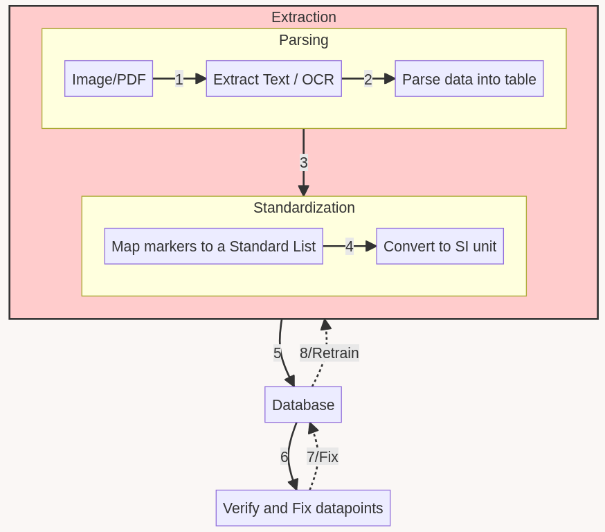
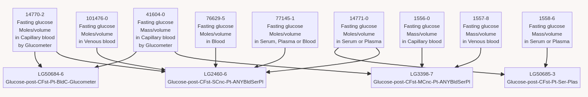
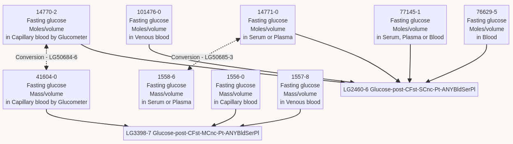
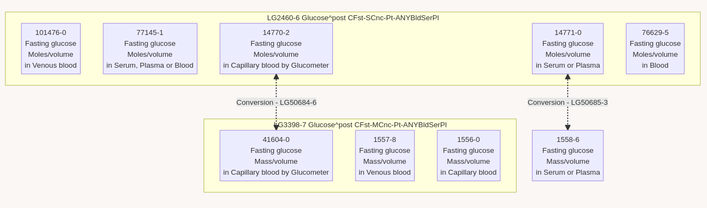

## Problem Statement

People who take their health seriously often get a lot of tests done. There are different kinds of tests (e.g. urine, blood markers, DEXA scans), done at different labs worldwide and the reports are often in different formats (e.g. different units used for the same parameter). That is to say, you are left with a bunch of pdf files and a stack of papers. This makes it really difficult to track how different parameters are changing over your lifetime, to identify which parameters need attention and to correlate them with other factors like diet, exercise, sleep, etc.

## Existing Solutions

1. Take your reports to a doctor and ask them to interpret it for you. This is expensive, time consuming and not scalable - both for the doctor and the patient.
2. Use a spreadsheet to track your biomarkers. This is time consuming and error prone, especially when changing units is concerned. It is also difficult to correlate biomarkers with other factors like diet, exercise, sleep, etc. Most biomarker tracking apps fall under this category.
3. Use a service like insideTracker, SelfDecode, or Siphox. You can send them your reports and they will do the conversion and data entry for you (takes a few days, so presumably they use humans too). The problem is that they are expensive, and they are focused on up-selling you supplements, regular screening packages, or at-home test kits.

There must be a better way![^gpt]

## First Crack

I started by constraining the problem to blood reports (because blood biomarkers are the most common), and gathered various sample reports from different people and labs.

The data pipeline was fairly straightforward, as you can see below:



### OCR and Parsing into a Table

I went with Azure's FormRecognizer API, with the most general "Just give me the Text" mode.
I was hoping to use either the "Table" Mode or the "Key Value Pair" mode, but it didn't do a great job at figuring out the rows and the columns in the table - especially because sample reports often had tables within tables, different languages, invisible borders, etc.

TODO: Show a report image
TODO: Show the OCR output

Surprisingly, sending the whole chunk of text to GPT4 (not 3.5-turbo) and asking it to parse it into a table worked well (much better than a human could from such a brick of text). I was able to get a table with the biomarker name, value and units. It could handle different languages, could extract the dates, and could handle tables within tables.

Sometimes, it would mis-align the rows (Biomarker in row X would match to value of row X+1), and that would mess up the neighboring biomarkers too. OCR APIs nowadays come with bounding boxes for each word, but that's too verbose for GPT to handle given limited context size. I talked to LifeOmics and NanoNets and their OCR API, but they were too expensive for my use case.

I suppose this will have to do until I can read up on the latest research on OCR, or wait for GPT4 with vision to come out.

<<quick note on image quality check - DIQA>>

### Creating a Standard List of Biomarkers

This is the part I was not expecting to get stuck at. I always assumed that there existed a standard list of biomarkers, ordered by how commonly they were used and with a table some regularly needed metadata. I was wrong.
No worries, let's create one for our app! We need the following:

1. A list of the most common biomarkers (e.g. `Hemoglobin`)

Foe each biomarker, we need:

1. Traditional units (e.g. `g/dL`)
2. Standard units (e.g. `g/L`)
3. Conversion factor for going from traditional to standard units (e.g. `1 g/dL = 10 g/L`)
4. Reference ranges (e.g. `12-16 g/dL`) (for display and analysis)
5. Synonyms (e.g. `Hb`, `Hgb`, `Haemoglobin`) (for mapping stage)
6. A description of what the biomarker is, along with a link to a good resource (e.g. [Wikipedia](https://en.wikipedia.org/wiki/Hemoglobin)) (for display)
7. Optimal ranges (e.g. `14-15 g/dL`) (for display and analysis)

There were quite a few sources that I could use to create a standard list, each with different levels of completeness. First, I need to decide how many biomarkers I will have a cutoff at. Then I have to painstakingly gather data from various sources for each of the X. https://www.labtestanalyzer.com/ focused on around 100 blood markers, insideTracker did around 50, Wikipedia had a pretty nice list, but only for blood markers (I know I said I'd constrain myself to just blood, but I was just thinking ahead). HealthMatters had a database of 3600 tests, and included more than just blood! https://www.labcorp.com/tests/, https://www.testing.com/tests/, https://www.mayocliniclabs.com/, and LOINC were much more comprehensive, but they contained way too many tests for me to compile manually.

I ended up kicking the can down the road, and using accessmedicine.mhmedical.com to get a list of ~500 markers, because they had most of what I needed for a Proof-of-Concept, and I could scrape it easily. It had the units, the conversion factors, and the reference ranges (we would ignore lab-specific reference ranges for now). I would populate the synonyms based on what the model got wrong over time. Descriptions and links can be added later, since they were not crucial to the MVP. I was surprised to find that the medical community didn't have consensus on what "optimal range" for different demographics was, so I decided to leave that can of worms for later too.

> This problem will soon come back to haunt me.

### Mapping OCR rows to Standard List

Each row in the OCR result (i.e. a biomarker picked up by GPT4 API), should correspond to a row in the Standard List (given the standard list is comprehensive enough). Since the problem is one of fuzzy search, the following:

1. vector embeddings with cosine similarity, to find the closest match. Fast, cheap, but not very accurate.
2. give gpt a prompt with the biomarker name, and ask it to pick the closest match from the standard list. Expensive, slow, but better.

I went with the second approach (for now). This also limits how big my standard marker list can be. In the event that the correct marker to map to exists in the standard list, GPT did a pretty good job.
In the event the correct marker did not exist in the standard list, it would sometimes still map to something (wrong) instead of leaving it blank.

<give the glucose -> fasting, urine examples>

### Converting Units

After seeing how well GPT did in the previous steps, my instinct was to use it to convert units too, hoping that giving conversion units would be enough to stop it from hallucinating the math. AGI won't be here as long as we don't let it do math.
So like a peasant without a magic genie to do my bidding, I had to write actual code :puke:

I found a library called `Pint` that could handle unit conversions if the SI unit and unit in the OCR result was of the same nature (e.g. mass/volume -> mass/volume). This could handle things like converting `g/dl` to `g/L`, even with the case mismatches. In other cases, I could use my conversion factor to go from the OCR unit to the SI unit (e.g. `mg` to `mmol` when talking about glucose in blood). Sometimes you had to combine the 2 approaches - use `pint` to go from OCR units to Traditional Unit in our table (traditional units differ across countries), and then use conversion factor to multiply. Any rows this approach failed on, I would send it to GPT to convert, and mark that this point may be wrong. This was a pretty good approach, and I was able to convert most of the units correctly.

<<link to pint and a quick tutorial in a code block>>

### Verification Workflow

There's no way this first take is going to work to the level of accuracy I want. The best thing to do at this point is to run each uploaded report through a verification workflow, where a human fixes (and comments on) the mistakes the model made. This would be used to modify the algorithm and/or finetune/train a model for the various steps. I would also use this process to populate the synonyms, increase the range of the standard list. Hopefully, the verification time is << the time it would take to manually enter the data for a human.

I wanted to write some code for a custom workflow for the verifiers. Nishanth, my cofounder, suggested I look for open source tools first. I found rowy and set it up over a day. While rowy has the ability to view firebase data as a table, and modify it on the go, there's much to be desired in terms of ergonomics and UX in this particular instance. I often find it slowing me down. I'll probably end up writing my own tool for this in the near future.

<<screenshot of rowy>>

The tool I envision will work like this:

1. Verifier runs a command with the ReportID into the tool.
2. The tool downloads the source report, translated into English and with any PII masked for privacy.
3. The tool formats the OCR result, standardization result and all the other fields into a csv file.
4. I would have lots of fast agents (i.e. a locally running llama variant or 3.5-turbo) run through each row and sanity check each cell with a set of relevant heuristics. If the heuristics fail, the cell is flagged for extra attention.
5. When the is verifying a row, the tool highlights where in the source report the OCR result came from (using the x, y coordinates I can pull from the OCR bounding boxes).
6. If the row is correct, verifier marks it as verified on the csv. If any row is incorrect, the row is corrected and a comment added to explain what went wrong.
7. Verifier runs a command to save the csv back to the database.

<<mock screenshot of the tool>>

### Quick Notes On Infrastructure

- The OCR is running on Azure. Pretty cheap and fast.
- The reports are stored in Google Firebase Storage.
- Biomarkers are written to Google's Cloud Firestore because we used FlutterFlow for the app, and it has a good Firestore integration out of the box.
- All of the code is written in Python I know it well, and it's easy to find libraries for most things.
- Cloud Functions listen for changes on Firestore for report uploads/reruns, and send it to a queue.
- The queue helps in throttling the pipeline since GPT4 tokens/minute is quite limited. Also allows for retries out of the box in the event of pipeline failures.
- Another Cloud Function listens to Stripe Webhooks for payments, and updates the user's number of credits.
- A docker container running the pipeline is deployed on Azure Container Instance. This is quite expensive, but given the slow response times of GPT and built-in retry mechanisms in the pipeline, it may take upto 10 minutes for a report to go through the while thing. Cloud functions unfortunately have a ~5 minute timeout. I've parallelized the pipeline where I can (e.g. each page of a report is processed in parallel), but I'm hesitant to parallelize it further. A lot of the times, the context surrounding a biomarker (i.e. other biomarkers), are important in determining the correct result.

## Taking Another Crack at Standardization

### Deconstruct the problem

Let's take a step back and deconstruct the problem again.

Every report has a set of datapoints. The datapoints look like:

```
{
  date,   // time the sample was taken
  biomarkerName,  // same biomarker is represented in different ways across the world
  units,  // can be in different convertible and inconvertible kinds of units (mass, moles, concentration, % etc.)
  value,
  typeOfSample // Implicit. e.g. blood, serum, plasma, saliva, urine, stool, RBC, spinal fluid, skin
}
```

I need a standard list of biomarkers that looks like:

```
{
  biomarkerName,
  typeOfSample, // because glucose in urine is a different biomarker from glucose in blood
  SI_units,
}
```

For example, for glucose if I may have the following 2 in my standard list:

```
{
  biomarkerName: "Fasting Glucose",
  typeOfSample: "blood",
  SI_units: "mmol/L",
}

{
  biomarkerName: "Fasting Glucose",
  typeOfSample: "urine",
  SI_units: "mmol/L",
}
```

Then I may have the following 3 datapoints from my reports:

```
{
  date: "2021-01-01",
  biomarkerName: "Fasting Glucose",
  typeOfSample: "serum", // inferred by gpt
  units: "mg/dl",
  value: 100,
}

{
  date: "2021-01-01",
  biomarkerName: "Fasting Glucose",
  typeOfSample: "urine", // inferred by gpt
  units: "mg/dl",
  value: 100,
}

{
  date: "2021-06-01",
  biomarkerName: "Glucose 2H after sugar",
  typeOfSample: "blood", // inferred by gpt
  units: "mg/dl",
  value: 150,
}

```

The first datapoint should match to `Fasting Glucose, Blood` (assume serum == plasma == blood for lab this test).
The second datapoint should match to `Fasting Glucose, Urine`.
For both of the above, the units should be converted to `mmol/L` (i.e. SI units). So we need information about glucose's molar mass.
The third datapoint should not match to any of the 2.

This example illustrates that:

1. You should have a comprehensive standard list, so you don't miss the 3rd datapoint.
2. The list should be at the right level of granularity. If we had 2 entries for `Fasting Glucose, Blood` and `Fasting Glucose, Serum`, or if we had one entry for `Fasting Glucose, blood, mass concentration` and `Fasting Glucose, blood, molar concenteraion`, then datapoints that should be in the same graph are split into different graphs - making it as good as not having a graph at all. However, if we had only 1 entry for `Fasting Glucose` that both blood and urine matched to, the graph would be nonsensical.
3. We need to cover convertible paths for a biomarker, such that we can always end up at the SI unit.

There may be thousands of these distinct biomarkers (judging from healthMatters), and tens of thousands of such combinations. Not feasible for me to create one manually - especially since I don't have a medical background.

Let's dig into a promising approach - leveraging LOINC.

### LOINC

[LOINC](https://loinc.org) is an international standard for identifying health measurements. Their latest release, 2.74, has about 100,000 terms. It's a comprehensive list, and it's free to use.
Here is what a LOINC term looks like:

```
{
  "LOINC_NUM": "2345-7",
  "COMPONENT": "Glucose [Moles/volume] in Serum or Plasma",
  "PROPERTY": "SCnc",
  "TIME_ASPCT": "Pt",
  "SYSTEM": "Ser/Plas",
  "SCALE_TYP": "Qn",
  "METHOD_TYP": "EIA",
  "CLASS": "CHEM",
  "VersionLastChanged": "2.74",
  "CHNG_TYPE": "MIN"
}
```

Let's look at another one - `Fasting glucose [Moles/volume] in Blood` - this time on the website: https://loinc.org/76629-5/

Some comments about everything we can learn from this:

1. If you search for Fasting Glucose on SearchLOINC, you have 28 matches.
2. The related names have lots of vague words - not all of these are good for matching against.
3. The fully specified name is pretty comprehensive and lines up with our problem deconstruction.
4. "Consumer Name" (Alpha) sounds useful, but is not present in the dataset you can download as csv.
5. "Common Test Rank" (Beta) has about 20k terms. This will be very useful if we want to Pareto this.
6. LOINC has something in Beta called "group" that groups multiple LOINC terms together. https://loinc.org/groups/

The group stuff is interesting and looks like what we'll need. Let's [search for Fasting glucose under groups](https://loinc.org/search/?t=4&s=fasting+glucose):

1. There'a a separate term for `Fasting glucose [Moles/volume] in _`,, where \_ can be any of Serum, Plasma, CSF, capillary blood, with glucometer etc. All these need to be grouped together. It's part of the group https://loinc.org/LG2460-6, which means we should match to this if we don't have enough information.
2. The urine one should be in a different group. This is the case.
3. There also exists such a group for `Fasting glucose [Mass/volume] in _` https://loinc.org/LG3398-7/
4. There doesn't exist any such group for `Fasting glucose in AnyBldSerPls` which will put bucket both these together. This is a problem.
5. However, there is a group that has the molar conversion - https://loinc.org/LG50685-3/ - between `Fasting glucose [Moles/volume] in Serum or Plasma` and `	Fasting glucose [Mass/volume] in Serum or Plasma`. There's also LG50684-6 for Glucometer, but the molar weight is the same.
6. Given 5, we have to decide whether we want to convert to Mass Concentration or Substance Concentration as default when storing in database.
7. LG34909-8 and LG4843-1 are saying the exact same thing. Why?
8. There's something like `Glucose [Mass/volume] in Serum or Plasma --1.5 hours post 0.05-0.15 U insulin/kg IV 12 hours fasting` which is a bit too specific. We should probably ignore these. It doesn't have a group either.

Let's draw a graph of what this looks like:



Let's remove the molar-mass conversion group and make it a path between the 2 nodes:

[^grouping2]

We can start seeing some problems with the LOINC dataset as it stands now in Beta (or at least out understanding of it):

1. Why does 1558-6 not go to LG3398-7?
2. `Fasting Glucose [Mass/volume] in Blood` (counterpart to 76629-5) does not exist. Why?
3. 77145-1 seems to be a superset of 14771-0 and 76629-5. This makes it a psuedo-group. Why is it not a group?
4. The conversion between moles/volume and mass/volume is only depicted for two pairs of tests (14771-0 and 1558-6, 14770-2 and 41604-0), while other pairs that could potentially have this conversion aren't represented this way. Why?

Let's assume bidirectional arrows between LOINC terms that are in the same group. That will become hard to draw, so let's just depict that inside a box:

[^grouping3]

If we ignore these problems, we can start seeing the hints of a solution:

1. Put the biomarkers through a matching algorithm such that it matches to the closest LOINC term it can find (based on vector embedding + cosine distance) and/or implicit assumptions made probabilistically (GPT API, common test rank).
2. Assume every node has a weight. For example, this could simply be the common test rank (probabilistic argument).
3. Traverse the graph until you reach the node with the highest weight (i.e. move it to other LOINC terms if they're in the same group, or convert to the other unit if they're in the same conversion group). You can think of this as hill-climbing. The traversal needs to be optimal (and non-greedy).

So now we need to store 3 datapoints per biomarker:

1. From the OCR: {date, name, value, units, sampleType} from the OCR
2. Most specific match to an entry in the LOINC standard: {LOINC code, value} (units = UCUM_UNITS, sampleType = SYSTEM)
3. Maxima on graph traversal (this is what's drawn on the dashboard by default): {LOINC code, value}

[^gpt]: The nice thing about a world with chatGPT is that you're no longer very intimidated to try things you can imagine.You (1) do a back and forth to brainstorm a solution with the chatbot, and (2) send the unstructured parts of the problem (i.e. the part you don't know how / are too lazy to deterministically handle) to the GPT API and iterate on the prompt.
[^grouping2]:
    ```
      graph TD
      14770-2[14770-2<br>Fasting glucose<br>Moles/volume<br>in Capillary blood by Glucometer]
      41604-0[41604-0<br>Fasting glucose<br>Mass/volume<br>in Capillary blood by Glucometer]
      14771-0[14771-0<br>Fasting glucose<br>Moles/volume<br>in Serum or Plasma]
      1558-6[1558-6<br>Fasting glucose<br>Mass/volume<br>in Serum or Plasma]
      1556-0[1556-0<br>Fasting glucose<br>Mass/volume<br>in Capillary blood]
      1557-8[1557-8<br>Fasting glucose<br>Mass/volume<br>in Venous blood]
      76629-5[76629-5<br>Fasting glucose<br>Moles/volume<br>in Blood]
      101476-0[101476-0<br>Fasting glucose<br>Moles/volume<br>in Venous blood]
      77145-1[77145-1<br>Fasting glucose<br>Moles/volume<br>in Serum, Plasma or Blood]
      LG3398-7[LG3398-7 Glucose-post-CFst-MCnc-Pt-ANYBldSerPl]
      LG2460-6[LG2460-6 Glucose-post-CFst-SCnc-Pt-ANYBldSerPl]

      14771-0<-.->|Conversion - LG50685-3|1558-6
      14770-2<-.->|Conversion - LG50684-6|41604-0

      41604-0-->LG3398-7
      1557-8-->LG3398-7
      1556-0-->LG3398-7

      101476-0-->LG2460-6
      77145-1-->LG2460-6
      14770-2-->LG2460-6
      14771-0-->LG2460-6
      76629-5-->LG2460-6
    ```

[^grouping3]:
    ```
    graph TD
      1558-6[1558-6<br>Fasting glucose<br>Mass/volume<br>in Serum or Plasma]

      subgraph LG3398-7 Glucose^post CFst-MCnc-Pt-ANYBldSerPl
          41604-0[41604-0<br>Fasting glucose<br>Mass/volume<br>in Capillary blood by Glucometer]
          1557-8[1557-8<br>Fasting glucose<br>Mass/volume<br>in Venous blood]
          1556-0[1556-0<br>Fasting glucose<br>Mass/volume<br>in Capillary blood]
      end

      subgraph LG2460-6 Glucose^post CFst-SCnc-Pt-ANYBldSerPl
          101476-0[101476-0<br>Fasting glucose<br>Moles/volume<br>in Venous blood]
          77145-1[77145-1<br>Fasting glucose<br>Moles/volume<br>in Serum, Plasma or Blood]
          14770-2[14770-2<br>Fasting glucose<br>Moles/volume<br>in Capillary blood by Glucometer]
          14771-0[14771-0<br>Fasting glucose<br>Moles/volume<br>in Serum or Plasma]
          76629-5[76629-5<br>Fasting glucose<br>Moles/volume<br>in Blood]
      end

      14771-0<-.->|Conversion - LG50685-3|1558-6
      14770-2<-.->|Conversion - LG50684-6|41604-0
    ```
